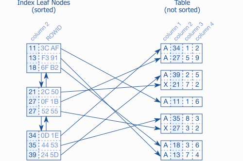
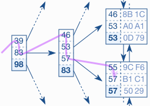

# Use the Index Luke

## Anatomy of the index

An index is a distinct structure in the database that is built using the create index statement. It requires its own disk space and holds a copy of the indexed table data.

### Leaf nodes

Databases use doubly linked lists to connect the so-called index `leaf nodes`. Data is stored in leaf nodes Each leaf node is stored in a database block or page; that is, the database’s smallest storage unit. All index blocks are of the same size—typically a few kilobytes. The database uses the space in each block to the extent possible and stores as many index entries as possible in each block.



illustrates the index leaf nodes and their connection to the table data. Each index entry consists of the indexed columns (the key, column 2) and refers to the corresponding table row (via ROWID or RID). Unlike the index, the table data is stored in a heap structure and is not sorted at all. There is neither a relationship between the rows stored in the same table block nor is there any connection between the blocks.

### B-Tree

Self balancing tree that have branching nodes to allow for navigation to the eventual leaf node. Allows accessing all elements with the same number of steps, and secondly because of the `logarithmic` growth of the `tree depth`.



### Slow Indexes

Even if there is a million entries the tree will only be 3 or 4 levels in depth, will rarley be 6 or deeper.

`INDEX UNIQUE SCAN`
(type `const` for Mysql) The INDEX UNIQUE SCAN performs the tree traversal only. The Oracle database uses this operation if a unique constraint ensures that the search criteria will match no more than one entry.

`INDEX RANGE SCAN`
(type `ref` for Mysql) The INDEX RANGE SCAN performs the tree traversal and follows the leaf node chain to find all matching entries. This is the fall­back operation if multiple entries could possibly match the search criteria.

`TABLE ACCESS BY INDEX ROWID`
The TABLE ACCESS BY INDEX ROWID operation retrieves the row from the table. This operation is (often) performed for every matched record from a preceding index scan operation. If there is a where clause that uses a column not in the index, it must use this to filter. Gets done before you select or sort.

The tree traversal is the only step that has an upper bound for the number of accessed blocks—the index depth. The other two steps might need to access many blocks—they cause a slow index lookup. The important point is that an `INDEX RANGE SCAN` can potentially read a large part of an index. If there is one more table access for each row, the query can become slow even when using an index.

## Where Clause

### Equality Operator

#### Primary key

Using a primary key in where clause only triggers a `INDEX UNIQUE SCAN` and `TABLE ACCESS BY INDEX ROWID`, so will be fast and only has to access the table storage once.

#### Concatenated Indexes (Composite key)

`The most important consideration when defining a concatenated index is how to choose the column order so it can be used as often as possible.`

A concatenated index is one index across multiple columns.

The database considers each column according to its position in the index definition to sort the index entries. The first column is the `primary sort criterion` and the second column determines the order only if two entries have the same value in the first column and so on.

If you have an index `scale_data (section, id1, id2)` and the where clause only uses `section` and `id2`, only section will be used as the access predicate, and id2 will be used for filter predicate. If section and id1 where used they can both be used as access predicates.

Even though the two-index solution delivers very good select performance as well, the single-index solution is preferable. It not only saves storage space, but also the maintenance overhead for the second index. The fewer indexes a table has, the better the insert, delete and update performance.

The first column qualifies for the `access predicate`.

#### Bad indexes

When you define a index that have multiple of the same values can slow down a query. If you do:

`WHERE last_name  = 'WINAND' AND subsidiary_id = 30`

And `subsidiary_id` is the first column in a composite key, It will do `INDEX RANGE SCAN`, will take up several steps to get all rowsids which are all done individually, and then it can do apply the `last_name` clause when it does the table access.

A `TABLE ACCESS FULL` can be faster for a huge subsidiary because it can read large parts from the table in one shot.

Choosing the best execution plan depends on the table’s data distribution as well so the optimizer uses statistics about the contents of the database. In our example, a histogram containing the distribution of employees over subsidiaries is used. If there were statistics that indicated that there were 1000 emplyees, the execution plan would say `INDEX RANGE SCAN` returns 1000 rows, and cause the query to have a higher cost. The optimizer will therefore automatically prefer the `FULL TABLE SCAN`.

### Functions

The optimizer treat functions like `UPPER(last_name)` as a blackbox. It is unable to use the index, and has to resort to full table scan.

#### Case-Insensitive

An index whose definition contains functions or expressions is a so-called `function-based index` (FBI). Instead of copying the column data directly into the index, a function-based index applies the function first and puts the result into the index. As a result, the index stores the names in all caps notation. E.g. `CREATE INDEX emp_up_name ON employees (UPPER(last_name))`.

SQL Server and MySQL do not support function-based indexes as described but both offer a workaround via computed or generated columns. To make use of this, you have to first add a computed column to the table that can be indexed afterwards:

`ALTER TABLE employees ADD last_name_up AS UPPER(last_name)`
`CREATE INDEX emp_up_name ON employees (last_name_up)`

#### User-defined

Cannot use a function in an index definition if its not `deterministic`. That means the result of the function call is not fully determined by its parameters. Only functions that always return the same result for the same parameters—functions that are deterministic—can be indexed.

Other examples for functions that cannot be “indexed” are random number generators and functions that depend on environment variables.

#### Over-Indexing

You might be tempted to just index everything, but this is in fact the very last thing you should do. The reason is that every index causes ongoing maintenance. Function-based indexes are particularly troublesome because they make it very easy to create `redundant` indexes.

### Parameterized Queries

(Using Bind parameters)

Bind parameters are, put simply, not visible to the optimizer just as the runtime values of variables are not known to the compiler.

When using bind parameters, the optimizer has no concrete values available to determine their frequency (important for determining if the index or full table scan should be used). It then just assumes an equal distribution (of the index) and always gets the same row count estimates and cost values. In the end, it will always select the same execution plan.

Note:
Column histograms are most useful if the values are not uniformly distributed. For columns with uniform distribution, it is often sufficient to divide the number of distinct values by the number of rows in the table. This method also works when using bind parameters.

From this perspective, it is a little bit paradoxical that bind parameters can improve performance if not using bind parameters enables the optimizer to always opt for the best execution plan. But the question is at what price? Generating and evaluating all execution plan variants is a huge effort that does not pay off if you get the same result in the end anyway. Not using bind parameters is like recompiling a program every time.

Dilemma:
Either effort is taken to evaluate all possible plan variants for each execution in order to always get the best execution plan or the optimization overhead is saved and a cached execution plan is used whenever possible—accepting the risk of using a suboptimal execution plan.

As the developer, you can use bind parameters deliberately to help resolve this dilemma. That is, you should always use bind parameters except for values that shall influence the execution plan.

### Searching for Ranges

Rule of thumb: index for equality first—then for ranges. All where clause conditions limit the scanned index range so that the scan terminates at the very same leaf node.

#### Indexing LIKE Filters

(with `widlcards`) LIKE filters can only use the characters `before` the first wild card during tree traversal. The remaining characters are just filter predicates that do not narrow the scanned index range. A single LIKE expression can therefore contain two predicate types: (1) the part before the first wild card as an access predicate; (2) the other characters as a filter predicate.

#### Index merge

`One index scan is faster than two.`

The database must scan both indexes first and then combine the results. The duplicate index lookup alone already involves more effort because the database has to traverse two index trees. Additionally, the database needs a lot of memory and CPU time to combine the intermediate results.

The best solution in many cases anyway is to accept the filter predicate and use a multi-column index nevertheless. The index definition should then mention the more selective column first so it can be used with an access predicate.

### Partial Indexes

Say you have `create index my_index on my_table (x, y)` but you only want certain values of y to be index to save disk space. You can do `create index my_index on my_table (x, y) where y = 'N'` and then `create index my_index on my_table (x) where y = 'N'` because y is always 'N' anyways.

### NULL in the Oracle Database

The Oracle database treats an empty string as `NULL`. It is, in fact, impossible to store an empty string in a VARCHAR2 field. If you try, the Oracle database just stores NULL.

#### Indexing NULL

The Oracle database does not include rows in an index if all indexed columns are NULLABLE. That means that every index is a partial index—like having a where clause.

What you can do is create an index (non_nullable, nullable), and it will work. Alternatively, we can use a constant expression that can never be NULL. That makes sure the index has all rows—even if DATE_OF_BIRTH is NULL. E.g. `(nullable '1')`

#### NOT NULL Constraints

An index on a user-defined function, however, does not impose a NOT NULL constraint on the index expression. If you want to use it in a index where is should be NOT NULL, then can go `where ... AND blackbox(employee_id) IS NOT NULL`. Oracle database recognizes that you only query rows that must be in the index per definition.

You could also move the function call to a virtual column (since 11g) and put a NOT NULL constraint on this column.

The Oracle database knows that some internal functions only return NULL if NULL is provided as input. E.g. if last_name is NOT NULL then if you do upper(last_name) it will preserve the NOT NULL.

### Obfuscated Conditions

Obfuscated conditions are where clauses that are phrased in a way that prevents proper index usage. This section is a collection of anti-patterns every developer should know about and avoid.

#### Numeric Strings

Numeric strings are numbers that are stored in text columns.Although it is a very bad practice, it does not automatically render an index useless if you consistently treat it as string. If you compare to a number the index won't work. Although some database yield an error (e.g. PostgreSQL) many databases just add an implicit type conversion.

Note that the problem does not exist the other way around E.g. going `WHERE numeric_number = '42'`. The database will consistently transform the string into a number. It does not apply a function on the potentially indexed column: a regular index will therefore work.

#### Combining columns

Use a redundant condition on the most significant column when a range condition combines multiple columns.

#### Smart Logic

The query optimizer (query planner) works at runtime; it analyzes each statement when received and generates a reasonable execution plan immediately. The overhead introduced by runtime optimization can be minimized with bind parameters.

Use dynamic SQL if you need dynamic where clauses. Still use bind parameters when generating dynamic SQL—otherwise the “dynamic SQL is slow” myth comes true.

MySQL does not suffer from this particular problem because it has no execution plan cache at all .

## Performance and Scalability

### Performance Impacts of Data Volume

Two ingredients that make an index lookup slow: (1) the table access (TABLE ACCESS BY INDEX ROWID), and (2) scanning a wide index range (INDEX RANGE SCAN).

Check the `predicate information` in the execution plan for information like the scanned index range (to see if scanning a large index range)

### Performance Impacts of System Load

Should take into account access rates (queries running concurrently) when tuning a query.

### Response Time, Throughput and Horizontal Scalability

Bigger hardware is not always faster—but it can usually handle more load. Bigger hardware is more like a wider highway than a faster car: you cannot drive faster—well, you are not allowed to—just because there are more lanes. That is the reason that more hardware does not automatically improve slow SQL queries.

Single core CPU power hit the wall during the first few years of the 21st century. There was almost no improvement on this axis anymore. To continue building ever more powerful CPUs, the vendors had to move to a multi-core strategy. Even though it allows multiple tasks to run concurrently, it does not improve performance if there is only one task. Performance has more than just one dimension.

Proper indexing is the best way to reduce query response time—in relational SQL databases as well as in non-relational systems.

More hardware will typically not improve response times. In fact, it might even make the system slower because the additional complexity might accumulate more latencies. The more complex the infrastructure gets, the more latencies accumulate and the slower the responses become. This effect often leads to the counterintuitive observation that the expensive production hardware is slower than the cheap desktop PC environment that was used for development.

Another very important latency is the disk seek time. Spinning hard disk drives `(HDD)` need a rather long time to place the mechanical parts so that the requested data can be read—typically a few milliseconds. This latency occurs four times when traversing a four level B-tree—in total: a few dozen milliseconds.

Databases do, however, cache frequently accessed data in the main memory. This is particularly useful for data that is needed for every index access—for example the index root nodes. `The database might fully cache frequently used indexes so that an index lookup does not trigger a single disk seek.`

## Joins

Joining is particularly sensitive to disk seek latencies because it combines scattered data fragments. Proper indexing is again the best solution to reduce response times. The correct index however depends on which of the three common join algorithms is used for the query.

There is, however, one thing that is common to all join algorithms: they process only two tables at a time. A SQL query with more tables requires multiple steps: first building an intermediate result set by joining two tables, then joining the result with the next table and so forth.

Although intermediate results explain the algorithm very well, it does not mean that the database has to materialize it. That would mean storing the intermediate result of the first join before starting the next one. Instead, databases use pipelining to reduce memory usage. That means that each row from the intermediate result is immediately pipelined to the next join operation—avoiding the need to store the intermediate result set.

The `optimizer` will therefore`evaluate all possible join order permutations and select the best one`. That means that just optimizing a complex statement might become a performance problem. The more tables to join, the more execution plan variants to evaluate—mathematically speaking: n! (factorial growth), though this is not a problem when using bind parameters.

Not using bind parameters is like recompiling a program every time.

### Nested loops

Take if you have Author and Book table, and you want to get all authors along with their bookings. Fetch all authors, then loop through them in code to fetch their books, basically N+1 problem like in graphql.

Is an anti-pattern, an SQL join is still more efficient than the nested selects approach—even though it performs the same index lookups—because it avoids a lot of network communication.

So just use a join instead. The db engine will fetch the rows from the first table before joining on the second (nested loop).

### Hash Join

The hash join algorithm aims for the weak spot of the nested loops join: the many B-tree traversals when executing the inner query. Instead it loads the candidate records from one side of the join into a hash table that can be probed very quickly for each row from the other side of the join.

The indexing strategy for a hash join is very different because there is `no need to index the join columns`. Only indexes for independent where predicates improve hash join performance.

Example: if you join Employees onto Sales, it loads all employees and loads into hash table in one go. Then uses that to join onto sales.

The join order does not influence indexing, unlike with nested loop joins. `Optimizing` hash join performance is to minimize the hash table size. The optimizer will therefore automatically use the smaller side of the join for the hash table. It is also possible to reduce the hash table size by changing the SQL query, for example by adding extra conditions so that the database loads fewer candidate records into the hash table.

Also possible to reduce the hash table size by selecting fewer columns—only the attributes you really need

MySQL introduced the hash join with version 8.0.18 in 2019.

- Hash joins do not need indexes on the join predicates. They use the hash table instead.
- A hash join uses indexes only if the index supports the independent predicates.
- Reduce the hash table size to improve performance; either horizontally (less rows) or vertically (less columns).
- Hash joins cannot perform joins that have range conditions in the join predicates (theta joins).

### Sort Merge

The sort-merge join combines two sorted lists like a zipper. Both sides of the join must be sorted by the join predicates.

Indexing the join predicates is useless, there is one aspect that is unique to the sort-merge join: absolute symmetry. The join order does not make any difference—not even for performance. This property is very useful for outer joins.

Although the sort-merge join performs very well once the inputs are sorted, it is hardly used because sorting both sides is very expensive. The hash join, on the other hand, needs to preprocess only one side.

The strength of the sort-merge join emerges if the inputs are already sorted. The hash join algorithm is superior in many cases nevertheless.

MySQL does not support sort-merge joins at all.

## Clustering Data

The simplest data cluster in an SQL database is the row. Databases store all columns of a row in the same database block if possible. Exceptions apply if a row doesn’t fit into a single block—e.g., when LOB types are involved.

### Index Filter Predicates Used Intentionally

Can be used to group consecutively accessed data together.

Rows a in a db are grouped together in blocks. The order of these blocks depends on the indexes. This will make `TABLE ACCESS BY INDEX ROWID` less intensive (less hdd reads).

`TABLE ACCESS BY INDEX ROWID` is not necessarily a bottleneck `if the accessed rows are stored in a single table block` because the database can fetch all rows with a `single read operation`. If the same rows are spread across many different blocks, in contrast, the table access can become a serious performance problem because the database has to fetch many blocks in order to retrieve all the rows. That means the performance depends on the physical distribution of the accessed rows—in other words: it depends on the clustering of rows.

This is exactly where the second power of `indexing—clustering` data—comes in. You can add many columns to an index so that they are automatically stored in a well defined order. That makes an index a powerful yet simple tool for clustering data.

Example have where clause: `WHERE subsidiary_id = ? AND UPPER(last_name) LIKE '%INA%'`. subsidiary_id is indexed but not last_name, will preform `INDEX RANGE SCAN` for the subsidiary_id access predicate, and `TABLE ACCESS BY INDEX ROWID` to filter further for last_name. If you instead add last_name to the index of subsidiary_id, then last_name can be applied on the `INDEX RANGE SCAN` (along with subsidiary_id) (now subsidiary_id and last_name are both on the `index leaf node`), now `TABLE ACCESS BY INDEX ROWID` will have less work to do.

The index size grows with the number of columns as well—especially when adding text columns. Of course the performance does not get better for a bigger index even though the logarithmic scalability limits the impact considerably. You should by no means add all columns that are mentioned in the where clause to an index but instead only use index filter predicates intentionally to reduce the data volume during an earlier execution step.

### Index-Only Scan: Avoiding Table Access

The index-only scan is one of the most powerful tuning methods of all. It not only avoids accessing the table to evaluate the where clause, but avoids accessing the table completely `if the database can find the selected columns in the index itself`.

The performance advantage of an index-only scans depends on the number of accessed rows and the index clustering factor. In practice, you should first index without considering the select clause and only extend the index if needed.

Some indexes have a good clustering factor automatically so that the performance advantage of an index-only scan is minimal.

### Index-Organized Tables and Clustered Indexes

The `index-only scan` executes an SQL statement using only the redundant data stored in the index. The original data in the heap table is not needed. If we take that concept to the next level and put all columns into the index, you may wonder why we need the heap table.

An `index-organized table` is thus a B-tree index without a heap table. This results in two benefits: (1) it saves the space for the heap structure; (2) every access on a clustered index is automatically an index-only scan. Both benefits sound promising but are hardly achievable in practice.

## Sorting and Grouping

Sorting is a very resource intensive operation. It needs a fair amount of CPU time, but the main problem is that the database must temporarily buffer the results. After all, a sort operation must read the complete input before it can produce the first output.

An indexed `order by` execution not only saves the sorting effort, however; it is also able to return the first results without processing all input data.

- The `B-Tree traversal` is the first power of indexing.
- `Clustering` is the second power of indexing.
- Pipelined `order by` is the third power of indexing.

### Indexing Order By

If the columns in the order by clasue is covered by an index, there is no need to sort, since the index delivers the rows in the required order.

If the database uses a sort operation even though you expected a pipelined execution, it can have two reasons: (1) the execution plan with the explicit sort operation has a better cost value; (2) the index order in the scanned index range does not correspond to the order by clause. Use the full index definition in the order by clause to find the reason for an explicit sort operation.

### Indexing ASC, DESC and NULLS FIRST/LAST

Databases can read indexes in both directions. If sorting `desc`, will use `INDEX RANGE SCAN DESCENDING` (find the last matching entry. From there on, it follows the leaf node chain “upwards” as shown, which is why doubly linked list is used).

When doing `order by col1 desc, col2 asc` will not be able to use the index, since db would have to jump during the index scan. Can use `CREATE INDEX sales_dt_pr ON sales (sale_date ASC, product_id DESC)` to fix this (doesnt work for mysql < 8.0), This does not affect the index’s usability for the where clause.

You can sort nulls by `NULLS FIRST` and `NULLS LAST`. But Database support for sorting `NULL` is sparse. The standard only states that all NULLs must appear together after sorting, but it does not specify if they should appear before or after the other entries. Mysql does'nt support sorting nulls first/last.

### Indexing Group By

Two algorithms; hash algorithm, sort/group algorithm

hash algorithm: aggregates the input records in a temporary hash table

sort/group algorithm: first sorts the input data by the grouping key so that the rows of each group follow each other in immediate succession. Afterwards, the database just needs to aggregate them.

In general, both algorithms need to materialize an intermediate state, so they are not executed in a pipelined manner. Nevertheless the sort/group algorithm can use an index to avoid the sort operation, thus enabling a pipelined group by.

## Partial Results

Take if you have some sort of infinite scroll behaviour. The related SQL queries used for this function can, however, cause serious performance problems if all messages must be sorted in order to find the most recent ones. A [pipelined order by](https://use-the-index-luke.com/sql/sorting-grouping/indexed-order-by) is therefore a very powerful means of optimization for such queries. Able to deliver the first results without reading and sorting all rows.

This chapter demonstrates how to use a pipelined order by to efficiently retrieve partial results.

### Querying Top-N Rows

Top-N queries are queries that limit the result to a specific number of rows. DB just aborts the execution after fetching the x amount of rows.

If we take the following example

```(sql)
SELECT *
  FROM sales
 ORDER BY sale_date DESC
 LIMIT 10
```

If there is an index on sale_date, a pipelined order by can be used since you can just read from the index. So no extra ordering needs to be done. Without it you would have to sort the entire table then pick out the 10 results. Using the top-N syntax is still better because the database does not need to materialize the full result but only the ten most recent rows. This requires considerably less memory.

The response time using a pipelined execution, however, only grows with the number of selected rows. In other words, the response time of a pipelined top-N query is always the same; this is almost independent of the table size. Only when the B-tree depth grows does the query become a little bit slower.

### Paging Through Results

When using `offset` database must count all rows from the beginning until it reaches the requested page. Doesnt scale well.

Using a cursor based approach (cursor is an index) the database can truly skip the rows from the previous pages

Important: Paging for cursor based requires a deterministic sort order.

Comparing these two where clauses for the cursor:

```(sql)
WHERE sale_date <= ? AND NOT (sale_date = ? AND sale_id >= ?)
```

AND

```(sql)
WHERE (
         (sale_date < ?)
       OR
         (sale_date = ? AND sale_id < ?)
      )
```

The bottom one looks clearer but the database uses the entire where clause as filter predicate. It treats the entire where as one and cannot factor out the first clause. But top one can use `sale_date` as the access predicate, and use the NOT for the filter predicate.

## Modifying Data

### Insert

The number of indexes on a table is the most dominant factor for insert performance. The more indexes a table has, the slower the execution becomes. The insert statement is the only operation that cannot directly benefit from indexing because it has no where clause.

Adding a new row to a table involves several steps. First, the database must find a place to store the row. For a regular heap table—which has no particular row order—the database can take any table block that has enough free space. This is a very simple. All the database has to do afterwards is to add the new entry to the respective data block.

If there are indexes on the table, the database must make sure the new entry is also found via these indexes. For this reason it has to add the new entry to each and every index on that table. The number of indexes is therefore a multiplier for the cost of an insert statement. Also needs to keep the index order and tree balance. That means the new entry cannot be written to any block—it belongs to a specific leaf node.

The index maintenance is, after all, the most expensive part of the insert operation. Each additional index slows the execution down further. The first index makes the greatest difference. To `optimize` insert performance, it is very important to keep the number of indexes small.

The performance without indexes is so good that it can make sense to temporarily drop all indexes while loading large amounts of data—provided the indexes are not needed by any other SQL statements in the meantime. This can unleash a dramatic speed-up which is visible in the chart and is, in fact, a common practice in data warehouses.

### Delete

Follows similar steps to insert, so has same drawbacks. But it can benfit from indexes to find the deleted rows.

Even delete and update statements have an execution plan.

### Update

The update performance, just like insert and delete, also depends on the number of indexes on the table. The only difference is that update statements do not necessarily affect all columns because they often modify only a few selected columns.

Really just depends if the columns you are updating are indexes or not. Also if you have x amount of indexes and you update one of them, the execution time will not group if x increases.

To optimize update performance, you must take care to only update those columns that were changed.

## MYSQL Execution Plan

<https://dev.mysql.com/doc/refman/5.6/en/explain-output.html>

Put `explain` infront of a query to the EP. The most important information is in the `TYPE` column. Can think of it as `access type` because it actually specifies how the data is accessed.

### eq_ref, const

Performs a B-tree traversal to find one row (like `INDEX UNIQUE SCAN`) and fetches additional columns from the table if needed (`TABLE ACCESS BY INDEX ROWID`). The database uses this operation if a primary key or unique constraint ensures that the search criteria will match no more than one entry.

### ref, range

Performs a B-tree traversal, walks through the leaf nodes to find all matching index entries (similar to `INDEX RANGE SCAN`) and fetches additional columns from the primary table store if needed (`TABLE ACCESS BY INDEX ROWID`).

### Index

Reads the entire index—all rows—in the index order (similar to `INDEX FULL SCAN`).

### ALL

Reads the entire table—all rows and columns—as stored on the disk (similar to `TABLE ACCESS FULL`). Besides high IO rates, a table scan must also inspect all rows from the table so that it can also put a considerable load on the CPU.

### Using Index (in the "Extra" column)

A `Index-Only Scan`. Means that the table is not accessed because the index has all the required data. Think of "using index ONLY". However, if a clustered index is used (e.g., the PRIMARY index when using InnoDB) “Using Index” does not appear in the Extra column although it is technically an Index-Only Scan.

### Key

What key is being used

### key_len

The length in bytes that the query is using of the index.

### PRIMARY (in the “key” or “possible_keys” column)

PRIMARY is the name of the automatically created index for the primary key.

### using filesort (in the “Extra” column)

`Non pipelined sort`. Needs large amounts of memory to materialize the intermediate result.

A MySQL execution plan does not show a `top-N query` explicitly. If you are using the limit syntax and don’t see “using filesort” in the extra column, it is executed in a pipelined manner.

### Distinguishing Access and Filter-Predicates

[difference between access and index filter predicates](https://use-the-index-luke.com/sql/where-clause/searching-for-ranges/greater-less-between-tuning-sql-access-filter-predicates)

[performance difference access and index filter](https://use-the-index-luke.com/sql/testing-scalability)

#### `ref`

The access predicates express the start and stop conditions of the leaf node traversal.

#### `Using index condition (in Extras)`

For Index filter predicates. They are applied during the leaf node traversal only. They do not contribute to the start and stop conditions and do not narrow the scanned range.

#### `Using where (in Extras)`

Table level filter predicate. Predicates on columns which are not part of the index are evaluated on the table level. For that to happen, the database must load the row from the table first.

## MISC

### TABLE ACCESS FULL

The operation `TABLE ACCESS FULL`, also known as full table scan, can be the most efficient operation in some cases anyway, in particular when retrieving a large part of the table.

This is partly due to the overhead for the `index lookup` itself, which does not happen for a `TABLE ACCESS FULL` operation. This is mostly because an `index lookup` reads one block after the other as the database does not know which block to read next until the current block has been processed. A `FULL TABLE SCAN` must get the entire table anyway so that the database can read larger chunks at a time (multi block read). Although the database reads more data, it might need to execute fewer read operations.

### Query optimizer

The query optimizer, or query planner, is the database component that transforms an SQL statement into an execution plan. This process is also called compiling or parsing. There are two distinct optimizer types.

`Cost-based optimizers (CBO)` generate many execution plan variations and calculate a cost value for each plan. The cost calculation is based on the operations in use and the estimated row numbers. In the end the cost value serves as the benchmark for picking the “best” execution plan.

`Rule-based optimizers (RBO)` generate the execution plan using a hard-coded rule set. Rule based optimizers are less flexible and are seldom used today.

#### Statistics

A `cost-based optimizer` uses statistics about tables, columns, and indexes. Most statistics are collected on the column level: the number of distinct values, the smallest and largest values (data range), the number of NULL occurrences and the column histogram (data distribution). The most important statistical value for a table is its size (in rows and blocks).

The most important index statistics are the tree depth, the number of leaf nodes, the number of distinct keys and the clustering factor (see Chapter 5, “Clustering Data”).

The optimizer uses these values to estimate the selectivity of the where clause predicates.

`Note`: Database does not update the table statistics when creating a new index.

### Execution Plan

A `predicate` is a  condition in the where clause.
The `access predicates` are the start and stop conditions for an index lookup. They define the scanned index range. Its what get used first. (Only fetching matched rows, usually has to done by index)
Index `filter predicates`  are applied during the leaf node traversal only. They do not narrow the scanned index range. (Discarding non-matched rows)

`Filter predicates` are like unexploded ordnance devices. They can explode at any time, in terms of time complexity.

see [mysql](https://use-the-index-luke.com/sql/explain-plan/mysql/access-filter-predicates)

- <https://use-the-index-luke.com/sql/explain-plan/mysql>

### Most Selective First

The myth that you should always put the most selective column to the first position; that is just wrong.

The most important consideration when defining a concatenated index is how to choose the column order so it can be used as often as possible.

The true essence of the myth is related to indexing independent range conditions—that is the only case where the selectivity should influence the index design.

### Index clustering factor

The index clustering factor is an indirect measure of the probability that two succeeding index entries refer to the same table block. The optimizer takes this probability into account when calculating the cost value of the TABLE ACCESS BY INDEX ROWID operation.

The correlation between index order and table order is a performance benchmark.
