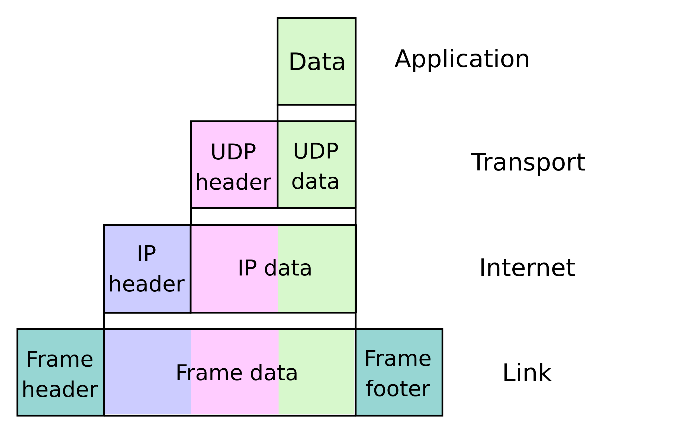

# 1 Computer Networks and the Internet

## 1.1 What Is the Internet?

Jargon: `End systems` are the the computers and other devices (e.g. phones. desktop computers, servers) connected to the Internet.
`End systems`(host machines) are connected together by a network of `communication links` and `packet switches`.

`Communication links` made up of different types of physical media, including coaxial cable, copper wire, optical fiber, and radio spectrum. Different links can transmit data at different rates, with the transmission rate of a link measured in bits/second.

A `packet switch` takes a packet arriving on one of its incoming communication links and forwards that packet on one of its outgoing communication links. Packet switches are mostly `routers` and `link-layer` switches.

An `ISP` is in itself a network of packet switches and communication links.

The `IP protocol` specifies the format of the packets that are sent and received among routers and end systems.

Internet standards are developed by the Internet Engineering Task Force (IETF)

### 1.1.2 A Services Description

The Internet has a `socket interface` that the program sending data must follow to have the Internet deliver the data to the program that will receive the data.

### 1.1.3 What Is a Protocol?

All activity in the Internet that involves two or more communicating remote entities is governed by a `protocol`.

Take entering a url to a webpage:
First, your computer will send a connection request message to the Web server and wait for a reply. The Web server will eventually receive your connection request message and return a connection reply message. Knowing that it is now OK to request the Web document, your computer then sends the name of the Web page it wants to fetch from that Web server in a GET message. Finally, the Web server returns the Web page (file) to your computer.

A `protocol` defines the format and the order of messages exchanged between two or more communicating entities, as well as the actions taken on the transmission and/or receipt of a message or other event.

## 1.2 The Network Edge

The network edge is made up of `end systems`. End systems are also referred to as `hosts` because they host (that is, run) application programs. Hosts are sometimes further divided into two categories: `clients` and `servers`.

### 1.2.1 Access Networks

An `access network` physically connects an end system to the first router (edge router) on a path from the end system to any other distant end system.

#### Home Access: DSL, Cable, FTTH, and 5G Fixed Wireless

The two most prevalent types of broadband residential access are `digital subscriber line` (DSL) and `cable`

`DSL`:
The home’s DSL modem takes digital data and translates it to high-frequency tones for transmission over telephone wires to the central office. Makes use of the telco’s existing local telephone infrastructure

The residential telephone line carries both data and traditional telephone signals simultaneously, which are encoded at different frequencies:
• A high-speed downstream channel, in the 50 kHz to 1 MHz band
• A medium-speed upstream channel, in the 4 kHz to 50 kHz band
• An ordinary two-way telephone channel, in the 0 to 4 kHz band
This approach makes the single DSL link appear as if there were three separate links

`Cable`:
Makes use of the cable television company’s existing cable television infrastructure. Because both fiber and coaxial cable are employed in this system, it is often referred to as `hybrid fiber coax` (HFC).

`Cable internet access` requires special modems, called cable modems. As with a DSL modem, the cable modem is typically an external device and connects to the home PC through an Ethernet port.

Cable modems divide the HFC network into two channels, a downstream and an upstream channel. As with DSL, access is typically asymmetric, with the downstream channel typically allocated a higher transmission rate than the upstream channel.

One important characteristic of cable Internet access is that it is a shared broadcast medium. In particular, every packet sent by the head end travels downstream on every link to every home and every packet sent by a home travels on the upstream channel to the head end. So if many people are all uploading or downloading at the same time, the speed will be slower.

`fiber to the home (FTTH)`:

Newer and faster technology, uses an optical fiber path from the CO directly to the home.

Each fiber leaving the central office is actually shared by many homes; it is not until the fiber gets relatively close to the homes that it is split into individual customer-specific fibers.

There are two competing optical-distribution network architectures that perform this splitting: `active optical networks` (AONs) and `passive optical networks` (PONs).

#### Access in the Enterprise (and the Home): Ethernet and WiFi

Typically have a a base station (the wireless access point), which communicates with the wireless PC and other wireless devices in the home; and a home router that connects the wireless access point, and any other wired home devices, to the Internet.

### 1.2.2 Physical Media

Ethernet and DSL use copper wire. Mobile access networks use radio spectrum.

For each transmitter-receiver pair, the bit is sent by propagating electromagnetic waves or optical pulses across a `physical medium`.

The physical medium can take many shapes and forms and does not have to be of the same type for each transmitter-receiver pair along the path.

Examples of physical media include twisted-pair copper wire, coaxial cable, multimode fiber-optic cable, terrestrial radio spectrum, and satellite radio spectrum. Physical media fall into two categories: `guided media` and `unguided media`.

With `guided media`, the waves are guided along a solid medium, such as a fiber-optic cable, a twisted-pair copper wire, or a coaxial cable.

With `unguided media`, the waves propagate in the atmosphere and in outer space, such as in a wireless LAN or a digital satellite channel.

The cost of the physical media is quite cheap compared to the labor.

#### Twisted-Pair Copper Wire

Lease expensive and most common. Consists of two insulated copper wires, each about 1 mm thick, arranged in a regular spiral pattern.

The wires are twisted together to reduce the electrical interference from similar pairs close by.

Modern twisted-pair technology, such as category 6a cable, can achieve data rates of 10 Gbps for distances up to a hundred meters.

#### Coaxial Cable

Like twisted pair, coaxial cable consists of two copper conductors, but the two conductors are concentric rather than parallel.

With this construction and special insulation and shielding, coaxial cable can achieve high data transmission rates.

#### Fiber Optics

An optical fiber is a thin, flexible medium that conducts pulses of light, with each pulse representing a bit. A single optical fiber can support tremendous bit rates, up to tens or even hundreds of gigabits per second.

They are immune to electromagnetic interference, have very low signal attenuation up to 100 kilometers, and are very hard to tap.

These characteristics have made fiber optics the preferred long-haul guided transmission media, particularly for overseas links. Many of the long-distance telephone networks in the United States and elsewhere now use fiber optics exclusively.

Not used to much in LAN because its pricy.

The Optical Carrier (OC) standard link speeds range from 51.8 Mbps to 39.8 Gbps

#### Terrestrial Radio Channels

Radio channels carry signals in the `electromagnetic spectrum`.

They are an attractive medium because they require no physical wire to be installed, can penetrate walls, provide connectivity to a mobile user, and can potentially carry a signal for long distances.

Terrestrial radio channels can be broadly classified into three groups: those that operate over very short distance (e.g., with one or two meters); those that operate in local areas, typically spanning from ten to a few hundred meters; and those that oper- ate in the wide area, spanning tens of kilometers.

#### Satellite Radio Channels

A communication satellite links two or more Earth-based microwave transmitter/receivers, known as ground stations. The satellite receives transmissions on one frequency band, regenerates the signal using a repeater, and transmits the signal on another frequency.

Two types of satellites are used in communications: `geostationary` satellites and `low-earth orbiting` (LEO) satellites.

Geostationary satellites don't move and are at 36,000km altitude. Often used in areas without access to DSL or cable-based Internet access.

LEO satellites are much lower and move around.

## 1.3 The Network Core

### 1.3.1 Packet Switching

Between source and destination, each packet travels through communication links and `packet switches` (for which there are two predominant types, `routers` and `link-layer switches`)

If a source end system or a packet switch is sending a packet of L bits over a link with transmission rate R bits/sec, then the time to transmit the packet is L/R seconds.

#### Store-and-Forward Transmission

Is what most packet switches use. The entire packet must be received until it can forward the first byte.

#### Queuing Delays and Packet Loss

Routes have a `output queue` (or `output buffer`) where packets wait for the outgoing link to be available.

In addition to the store-and-forward delays, packets suffer output buffer `queuing delays`.

`Packet loss` occurs when the buffer is full with other packets that are waiting.

#### Forwarding Tables and Routing Protocols

How does the router determine which link it should forward the packet onto?

Each router has a forwarding table that maps destination addresses (or portions of the destination addresses) to a router’s outbound links.

When a packet arrives at a router, the router examines the address and searches its forwarding table, using this destination address, to find the appropriate outbound link. The router then directs the packet to this outbound link.

Routing is hierarchical, for example sending a packet from NZ to street in AUS the first group of routes is concerted with getting towards AUS, then the to the city in aus and then the street.

But this statement begs yet another question: How do forwarding tables get set? See Chapter 5

### 1.3.2 Circuit Switching

The other fundamental approach to moving data through a network of links and switches.

Used for telephone networks.

With `circuit switching` communication between the end systems are reserved for the duration of the communication session between the end systems. In `packet switching` resources are not reserved.

Before the sender can send the information, the network must establish a connection between the sender and the receiver. This is a bona fide connection for which the switches on the path between the sender and receiver maintain connection state for that connection (this is called a `circuit`).

When the network establishes the `circuit`, it also reserves a constant (guaranteed) transmission rate in the network’s links.

#### Multiplexing in Circuit-Switched Networks

A circuit in a link is implemented with either `frequency-division multiplexing` (FDM) or `time-division multiplexing` (TDM).

`FDM`: the frequency spectrum of a link is divided up among the connections established across the link for the duration of the connection.
`TDM`: each circuit gets all of the bandwidth periodically during brief intervals of time (that is, during slots). So in your time slot you can transmit. You keep the same time slot. Slots are grouped into frames, you get one of your slots in the frame. Transmission rate = frames per sec / size of slot.

Proponents of packet switching have always argued that circuit switching is wasteful because the dedicated circuits are idle during `silent periods`

Let us consider how long it takes to send a file of 640,000 bits from Host A to Host B over a circuit-switched network. Suppose that all links in the network use TDM with 24 slots and have a bit rate of 1.536 Mbps. Also suppose that it takes 500 msec to establish an end-to-end circuit before Host A can begin to transmit the file. How long does it take to send the file? Each circuit has a transmission rate of (1.536 Mbps)/24 = 64 kbps, so it takes (640,000 bits)/(64 kbps) = 10 seconds to transmit the file. To this 10 seconds we add the circuit establishment time, giving 10.5 seconds to send the file. Note that the transmission time is independent of the number of links: The transmission time would be 10 seconds if the end-to-end circuit passed through one link or a hundred links.

#### Packet Switching Versus Circuit Switching

Packet switching is simpler, more efficient, and less costly to implement than circuit switching.

Although packet switching and circuit switching are both prevalent in today’s telecommunication networks, the trend has certainly been in the direction of packet switching. Even many of today’s circuit-switched telephone networks are slowly migrating toward packet switching.

### 1.3.3 A Network of Networks

End systems connect into the Internet via an access ISP. The access ISP can provide either wired or wireless connectivity, using an array of access technologies including DSL, cable, FTTH, Wi-Fi, and cellular.

ISPs themselves must be interconnected. This is done by creating a `network of networks`.

#### Network Structure 3

ISPs can be represented in a hierarchy, where there are access ISPs that connect to regional ISPs that connect to tier-1 ISPs. Referred to as Network Structure 3. Tier 1 provide somewhat of a global access, but do not have a presence in every city in the world, they don't also have to pay a provider. Access ISPs pay the regional, regional pay the tier-1. Tier-1 ISPs also peer with one another, settlement-free, for full access.

For example, in China, there are access ISPs in each city, which connect to provincial ISPs, which in turn connect to national ISPs, which finally connect to tier-1 ISPs.

#### Network Structure 4

This is still a crude approximation of today's internet. To build a network that more closely resembles today’s Internet, we must add points of presence (PoPs), multi-homing, peering, and Internet exchange points (IXPs) to the hierarchical Network Structure 3.

`POP`: At every level accept access ISPs. Just a group of one or more routers in the providers network that ISPs can connect to. Any ISP (except tier-1) can choose to `multi-home`, where you connect to two or more provider ISPs. E.g. an access ISP may multi-home with two regional ISPs, or it may multi- home with two regional ISPs and also with a tier-1 ISP. This way it handles failure.
`Peering`: when two ISPs at the same level directly connect with each other, settlement-free, to cut costs on provider ISP fees.
`IXP`: third party that provides a meeting point where multiple ISPs can peer together.

#### Network Structure 5

Describes today’s Internet. Builds on top of Network Structure 4 by adding `content-provider networks`. Google has one of these spanning the globe. All their data centers are interconnected via its private TCP/IP network.

Google private network attempts to “bypass” the upper tiers of the Internet by peering (settlement free) with lower-tier ISPs, either by directly connecting with them or by connecting with them at IXPs.

However, because many access ISPs can still only be reached by transiting through tier-1 networks, the Google network also connects to tier-1 ISPs, and pays those ISPs for the traffic it exchanges with them.

By creating its own network, a content provider not only reduces its payments to upper-tier ISPs, but also has greater control of how its services are ultimately delivered to end users.

## 1.4 Delay, Loss, and Throughput in Packet-Switched Networks

### 1.4.1 Overview of Delay in Packet-Switched Networks

As a packet travels from one node (host or router) to the subsequent node (host or router) along this path, the packet suffers from several types of delays at each node along the path.

The most important of these delays are the `nodal processing delay`, `queuing delay`, `transmission delay`, and `propagation delay`; together, these delays accumulate to give a `total nodal delay`.

#### Processing Delay

The time required to examine the packet’s header and determine where to direct the packet. Could also include the time needed to check for bit-level errors, and other factors.

#### Queuing Delay

The time waiting in the queue.

#### Transmission Delay

The amount of time required to push (that is, transmit) all of the packet’s bits into the link.

#### Propagation Delay

The time it takes for the packet to travel on the link from A to B. The propagation delay is the distance between two routers divided by the propagation speed.

### 1.4.2 Queuing Delay and Packet Loss

let `L` denote the size in bits of each packet
let `a` denote the average rate at which packets arrive at the queue (a is in units of packets/sec)
let `R` be the transmission rate, the rate (in bits/sec) at which bits are pushed out of the queue

The ratio `La/R`, called the `traffic intensity`, often plays an important role in estimating the extent of the queuing delay.

If La/R > 1, then the average rate at which bits arrive at the queue exceeds the rate at which the bits can be transmitted from the queue. In this unfortunate situation, the queue will tend to increase without bound and the queuing delay will approach infinity

As the `traffic intensity` approaches 1, the average queuing delay increases rapidly. A small percentage increase in the intensity will result in a much larger percentage-wise increase in delay.

#### Packet Loss

A packet can arrive to find a full queue. With no place to store such a packet, a router will `drop` that packet; that is, the packet will be lost.

From an end-system viewpoint, a packet loss will look like a packet having been transmitted into the network core but never emerging from the network at the destination.

### 1.4.3 End-to-End Delay

#### Traceroute

You specify a host name and it sends out N special packets, where N-1 is the number of routers between source and destination.

When the first router receives the first packet it sends back the name and address of the router. This repeats incrementally until it gets to the destination host.

It does three lots of this, so ends 3\*N packets.

The output has six columns: the `first` column is the n value described above, that is, the number of the router along the route; the `second` column is the name of the router; the `third` column is the address of the router (of the form xxx.xxx.xxx.xxx); `the last three columns` are the round-trip delays for three experiments.

If there was packet loss then an asterisk after the router number.

There are a number of free software programs that provide a graphical interface to Traceroute; one of our favorites is PingPlotter.

### 1.4.4 Throughput in Computer Networks

If transferring a file from A to B. The instantaneous throughput at any instant of time is the rate (in bits/sec) at which Host B is receiving the file.

If you have a simple network of server->router->client, where Rs is rate of the link from server to router, and Rc router->client. The throughput is the min(Rs, Rc), or the `bottleneck link`.

If you have N links between server and client, the throughput is min(R1, R2, ...Rn).

If you had a link that is being `shared` by 10 clients trying to download, the shared link rate will be R/10, and may be the bottleneck.

## 1.5 Protocol Layers and Their Service Models

For large and complex systems that are constantly being updated, the ability to change the implementation of a service without affecting other components of the system is another important advantage of layering.

To provide structure to the design of network protocols, each protocol belongs to one of the layers.

We are interested in the services that a layer offers to the layer above—the so-called service model of a layer.

### Application Layer

Network applications and their application-layer protocols reside. Includes many protocols, such as HTTP, FTP, and SMTP.

### Transport Layer

Transports application-layer messages between application endpoints. In the Internet, there are two transport protocols, `TCP` and `UDP`.

In this book, we’ll refer to a transport-layer packet as a `segment`.

### Network Layer

Responsible for moving network-layer packets known as `datagrams` from one host to another. Contains both the IP protocol and numerous routing protocols

### Link Layer

The Internet’s network layer routes a `datagram` through a series of routers between the source and destination. To move a packet from one node (host or router) to the next node in the route, the network layer relies on the services of the link layer

At each node, the network layer passes the datagram down to the link layer, which delivers the datagram to the next node along the route. At this next node, the link layer passes the datagram up to the network layer.

Examples of link-layer protocols include Ethernet, WiFi, and the cable access network’s DOCSIS protocol

In this book, we’ll refer to the link-layer packets as `frames`.

### Physical Layer

While the job of the link layer is to move entire frames from one network element to an adjacent network element, the job of the physical layer is to move the individual bits within the frame from one node to the next.

The protocols in this layer are again link dependent and further depend on the actual transmission medium of the link (for example, twisted-pair copper wire, single-mode fiber optics).

### 1.5.2 Encapsulation

End systems will deal with all layers. Link layer switches just link and physical, routers have network, link and physical.

application-layer message -> transport-layer segment -> network-layer datagram -> link-layer frame.

## 1.6 Networks Under Attack

`Vulnerability attack`. This involves sending a few well-crafted messages to a vulnerable application or operating system running on a targeted host. If the right sequence of packets is sent to a vulnerable application or operating system, the service can stop or, worse, the host can crash.

`Bandwidth flooding`. The attacker sends a deluge of packets to the targeted host—so many packets that the target’s access link becomes clogged, preventing legitimate packets from reaching the server.

If the server has an access rate of R bps, then the attacker will need to send traffic at a rate of approximately R bps to cause damage

`Connection flooding`. The attacker establishes a large number of half-open or fully open TCP connections (TCP connections are discussed in Chapter 3) at the target host. The host can become so bogged down with these bogus connections that it stops accepting legitimate connections.
