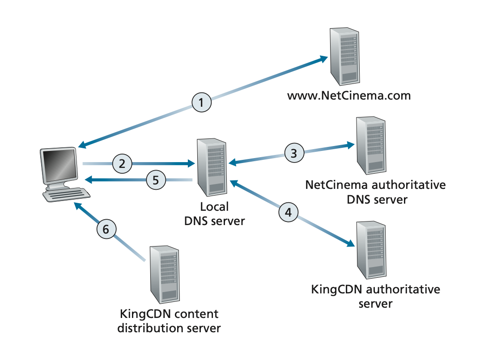

# Application Layer

# 2.1 Principles of Network Applications

## 2.1.1 Network Application Architectures

Two types: Client-server and P2P

## 2.1.2 Processes Communicating

### The Interface Between the Process and the Computer Network

Any message sent from one process to another must go through the underlying network. A process sends messages into, and receives messages from, the network through a software interface called a `socket`.

### Addressing Processes

in order for a process running on one host to send packets to a process running on another host, the receiving process needs to have an address. To identify the receiving process, two pieces of information need to be specified:

1. the address of the host (IP address)
2. an identifier that specifies the receiving process in the destination host (port number)

## 2.1.3 Transport Services Available to Applications

Can broadly classify the possible services along four dimensions: reliable data transfer, throughput, timing, and security.

### Reliable Data Transfer

If a protocol provides delivery correctly and completely guaranteed, it is said to provide `reliable data transfer`

### Throughput

Is the rate at which the sending process can deliver bits to the receiving process.

Applications that have throughput requirements (e.g. constant of k bits per second) are said to be `bandwidth-sensitive applications`

`Elastic applications` can make use of as much, or as little, throughput as happens to be available

### Timing

A transport-layer protocol can also provide timing guarantees.

e.g. in a multiplayer game or virtual interactive environment, a long delay between taking an action and seeing the response from the environment makes the application feel less realistic.

### Security

A transport protocol can also provide other security services in addition to confidentiality, including data integrity and end-point authentication

## 2.1.4 Transport Services Provided by the Internet

`TCP` and `UDP`

### TCP Services

Includes

- a `connection-oriented`: a connection exists between two sockets after a handshake
- `reliable data` transfer service: deliver all data sent without error and in the proper order. When one side of the application passes a stream of bytes into a socket, it can count on TCP to deliver the same stream of bytes to the receiving socket.
- `congestion-control mechanism`: throttles a sending process (client or server) when the network is congested between sender and receiver. Also limits each TCP connection to its fair share of network bandwidth.

### UDP Services

Lightweight and connectionless, no congestion-control mechanism

When a process sends a message into a UDP socket, UDP provides no guarantee that the message will ever reach the receiving process. Furthermore, messages that do arrive at the receiving process may arrive out of order.

### Securing TCP (TSL)

Transport Layer Security (TLS) is an enhancement (not a third protocol) for TCP to include encryption, data integrity, and end-point authentication.

It is implemented in the `application layer`.

TLS has its own socket API that is similar to the traditional TCP socket API. When an application uses TLS, the sending process passes `cleartext` data to the TLS socket; TLS in the sending host then `encrypts` the data and passes the encrypted data to the TCP socket. Same happens when server receives it, TCP socket passes the encrypted data to the TLS socket, which passes the clear text to process.

### Services Not Provided by Internet Transport Protocols

Today’s Internet can often provide satisfactory service to time-sensitive applications, but it cannot provide any timing or throughput guarantees.

Internet telephony applications usually prefer to run their applications over UDP, thereby circumventing TCP’s congestion control mechanism and packet overheads. But because many firewalls are configured to block (most types of) UDP traffic, Internet telephony applications often are designed to use TCP as a backup if UDP communication fails.

## 2.1.5 Application-Layer Protocols

Some application-layer protocols are specified in RFCs like HTTP, are proprietary and intentionally not available in the public domain, e.g. Skype uses proprietary application-layer protocols.

# 2.2 The Web and HTTP

## 2.2.1 Overview of HTTP

HTTP is implemented in two programs: a client program and a server program

HTTP defines the structure the messages sent from client and server, and how they are exchanged.

HTTP defines how Web clients request Web pages from Web servers and how servers transfer Web pages to clients.

A Web page (also called a document) consists of `objects`. An object is simply a file, such as an HTML file, a JPEG image, a Javascrpt file, a CCS style sheet file, or a video clip—that is addressable by a single URL. Most Web pages consist of a `base HTML file` and several referenced objects.

When a user requests a Web page (for example, clicks on a hyperlink), the browser sends HTTP request messages for the objects in the page to the server. The server receives the requests and responds with HTTP response messages that contain the objects.

HTTP uses TCP as its underlying transport protocol

HTTP is said to be a `stateless protocol` because it does not remember the requests of the client.

## 2.2.2 Non-Persistent and Persistent Connections

### HTTP with Non-Persistent Connections

Each non-persistent TCP connection transports exactly one request message and one response message.

Suppose the page consists of a base HTML file and 10 JPEG images (11 total objects). When a user requests the Web page, 11 TCP connections are generated.

Because of a three way handshake, the response time is roughly two RTTs (`round-trip time`), to receive an object.

### HTTP with Persistent Connections

With HTTP/1.1 persistent connections, the server leaves the TCP connection open after sending a response. Subsequent requests and responses between the same client and server can be sent over the same connection.

Typically, the HTTP server closes a connection when it isn’t used for a certain time (a configurable timeout interval).

The `default` mode of HTTP uses persistent connections with pipelining (without waiting for replies to pending requests, aka run in parallel).

## 2.2.3 HTTP Message Format

### HTTP Request Message

```
GET /somedir/page.html HTTP/1.1
Host: www.someschool.edu
Connection: close
User-agent: Mozilla/5.0
Accept-language: fr
(... body (if post,put))
```

By including the `Connection: close` header line, the browser is telling the server that it doesn’t want to bother with persistent connections; it wants the server to close the connection after sending the requested object.

### HTTP Response Message

```
HTTP/1.1 200 OK
Connection: close
Date: Tue, 18 Aug 2015 15:44:04 GMT
Server: Apache/2.2.3 (CentOS)
Last-Modified: Tue, 18 Aug 2015 15:11:03 GMT Content-Length: 6821
Content-Type: text/html
(body data ...)
```

The `Last-Modified:` header line indicates the time and date when the object was created or last modified.

The `Content-Type:` header line indicates that the object in the entity body is HTML text

Can use `netcat` to establish a TCP connection to a host on port 80, and send http requests.

## 2.2.4 User-Server Interaction: Cookies

Cookies can be used to create a user session layer on top of stateless HTTP.

Server sends back a response with the header `Set-cookie: xxx`.

Each client HTTP request includes header `Cookie: xxx`.

## 2.2.5 Web Caching

A `Web cache` also called a `proxy server` is a network entity that satisfies HTTP requests on the behalf of an origin Web server.

If browser is requesting the object <http://www.someschool.edu/campus.gif>. Here is what happens:

1. The browser establishes a TCP connection to the Web cache and sends an HTTP request for the object to the Web cache.
2. The Web cache checks to see if it has a copy of the object stored locally. If it does, the Web cache returns the object within an HTTP response message to the client browser.
3. If the Web cache does not have the object, the Web cache opens a TCP connection to the origin server, that is, to www.someschool.edu. The Web cache then sends an HTTP request for the object into the cache-to-server TCP connection. After receiving this request, the origin server sends the object within an HTTP response to the Web cache.
4. When the Web cache receives the object, it stores a copy in its local storage and sends a copy, within an HTTP response message, to the client browser (over the existing TCP connection between the client browser and the Web cache).

Typically a Web cache is purchased and installed by an ISP

Hit rates—the fraction of requests that are satisfied by a cache— typically range from 0.2 to 0.7 in practice.

Through the use of Content Distribution Networks (CDNs), Web caches are increasingly playing an important role in the Internet. A CDN company installs many geographically distributed caches throughout the Internet, thereby localizing much of the traffic.

### The Conditional GET

The cache may be stale, using a `conditional GET` on a HTTP request solves this.

An HTTP request message is a so-called conditional GET message if (1) the request message uses the GET method and (2) the request message includes an `If-Modified-Since`: header line.

When the cache server first queries the web-server, the web-server responds with a `Last-Modified` header, which the cache stores along with the object. If the cache thinks it might be out of date it queries the web server with the `If-modified-since` header, which has the same value as the `Last-Modified` header. If the webserver determines that the resource hasn't changed, it responds with `304 Not Modified`, with an empty body.

## 2.2.6 HTTP/2

Standardized in 2015.

The `primary goals` for HTTP/2 are to `reduce perceived latency` by enabling `request and response multiplexing over a single TCP connection`, provide `request prioritization` and `server push`, and provide `efficient compression of HTTP header fields`.

HTTP/2 `does not change` HTTP methods, status codes, URLs, or header fields. Instead, HTTP/2 `changes how the data is formatted and transported` between the client and server.

Sending all the objects in a Web page over a single TCP connection has a `Head of Line (HOL) blocking` problem.

### HOL

Take a web page includes the base html a video file, and many images below the video file. The video file larger and will block the later requests in a single HTTP connection.

HTTP/1.1 Browsers worked around this by opening up multiple TCP connections (usually up to 6) to get the objects in parallel, reducing user-perceived delay.

TCP `congestion control` aims to give each TCP connection sharing a bottleneck link an equal share of the available bandwidth of that link; so if there are n TCP connections operating over a bottleneck link, then each connection approximately gets 1/nth of the bandwidth.

One of the `primary goals` of HTTP/2 is to get rid of (or at least reduce the num- ber of) parallel TCP connections for transporting a single Web page. This not only reduces the number of sockets that need to be open and maintained at servers, but also allows TCP congestion control to operate as intended.

But with only `one TCP connection` to transport a Web page, HTTP/2 requires carefully designed mechanisms to avoid HOL blocking.

### HTTP/2 Framing

The HTTP/2 solution for HOL blocking is to break each message into small frames, and interleave the request and response messages on the same TCP connection.

If you need to send 1 video clip worth 1000 frames and 8 images all worth 2 frames. With frame interleaving, after sending one frame from the video clip, the first frames of each of the small objects are sent. Then after sending the second frame of the video clip, the last frames of each of the small objects are sent.

If interleaving were not used, the smaller objects would be sent only after sending 1016 frames.

The header field of the response becomes one frame, and the body of the message is broken down into one for more additional frames.

### Response Message Prioritization and Server Pushing

When a client sends concurrent requests to a server, it can prioritize the responses it is requesting by assigning a weight between 1 and 256 to each message.

Another feature of HTTP/2 is the ability for a server to send multiple responses for a single client request. This is possible since the HTML base page indicates the objects that will be needed to fully render the Web page. So instead of waiting for the HTTP requests for these objects, the server can analyze the HTML page, identify the objects that are needed, and send them to the client before receiving explicit requests for these objects. `Server push` eliminates the extra latency due to waiting for the requests.

### HTTP/3

A new HTTP protocol that is designed to operate over QUIC

# 2.3 Electronic Mail in the Internet

`SMTP` is the principal application-layer protocol for Internet electronic mail. It uses the reliable data transfer service of `TCP` to transfer mail from the sender’s mail server to the recipient’s mail server.

Examples of user agents for e-mail include Microsoft Outlook, Apple Mail, Gmail.

SMTP has two sides: a client side, which executes on the sender’s mail server, and a server side, which executes on the recipient’s mail server.

When a mail server sends mail to other mail servers, it acts as an SMTP client. When a mail server receives mail from other mail servers, it acts as an SMTP server.

## 2.3.1 SMTP

Take example of sending email from alice to bob.

Alice uses her user-agent to send message, which goes to her mail server. A queue on the Mail server picks it up and establishes a TCP connection with bobs server, if it can't make one it tries again later. It sends the message and Bob’s mail server then places the message in Bob’s mailbox. Bob then uses his user-agent to read the message at a convince.

Alice's agent --SMTP--> Alice's mail server --SMTP--> Bob's mail server --HTTP OR IMAP --> Bob's agent

### 2.3.2 Mail Message Formats

### 2.3.3 Mail Access Protocols

# 2.4 DNS—The Internet’s Directory Service

There are two ways to identify a host—by a hostname and by an IP address

## 2.4.1 Services Provided by DNS

The `DNS` is (1) a distributed database implemented in a `hierarchy` of DNS servers, and (2) an application-layer protocol that allows hosts to query the distributed database.

The DNS protocol `runs over UDP` and uses `port 53`.

Steps when requesting www.someschool.edu:

1. The same user machine runs the client side of the DNS application.
2. The browser extracts the hostname, www.someschool.edu, from the URL
   and passes the hostname to the client side of the DNS application.
3. The DNS client sends a query containing the hostname to a DNS server.
4. The DNS client eventually receives a reply, which includes the IP address for
   the hostname.
5. Once the browser receives the IP address from DNS, it can initiate a TCP connection
   to the HTTP server process located at port 80 at that IP address.

DNS provides a few other important services in addition to translating host- names to IP addresses:

- `Host aliasing`: A host with a complicated hostname can have one or more alias names. For example, a hostname such as relay1.west-coast .enterprise.com could have, say, two aliases such as enterprise.com and www.enterprise.com. In this case, the hostname relay1.west-coast.enterprise.com is said to be a `canonical hostname`. So DNS would need to find the canonical hostname as well as the IP address.
- `Mail server aliasing`: DNS can be invoked by a mail application to obtain the canonical hostname (e.g. relay1.west-coast.yahoo.com) for a supplied alias hostname as well as the IP address of the host
- `Load distribution`: DNS is also used to perform load distribution among replicated servers, such as replicated Web servers. Busy sites, such as cnn.com, are replicated over multiple servers, with each server running on a different end sys- tem and each having a different IP address. If replicated, DNS returns a set of ip address, but changes up the order each time, since clients usually just select the first one.

## 2.4.2 Overview of How DNS Works

When entering a hostname in browser, the browser invokes the client side of DNS, specifying the hostname that needs to be translated. On unix systems its `gethostbyname()`.

DNS in the user’s host then takes over, sending a query message into the network. All DNS query and reply messages are sent within UDP datagrams to port 53.

### A Distributed, Hierarchical Database

`three classes` of DNS servers (ranked by hierarchy);

1. root DNS servers
2. top-level domain (TLD) DNS servers
3. authoritative DNS servers

When getting ip of say `www.amazon.com`:

1. The client first contacts one of the `root` servers, which returns IP addresses for `TLD` servers for the top-level domain `com`.
2. The client then contacts one of these `TLD` servers, which returns the IP address of an `authoritative` server for `amazon.com`
3. Finally, the client contacts one of the `authoritative` servers for `amazon.com`, which returns the IP address for the hostname www.amazon.com.

#### Root DNS servers

More than 1000 scattered all over the world. Provide the IP addresses of the TLD servers.

#### Top-level domain (TLD) servers

Exist for each of the top level domains (com, org, net, etc.), and country domains (fr, uk, etc.). Provide the IP addresses for authoritative DNS servers.

#### Authoritative DNS servers

Every organization with publicly accessible hosts on the Internet, must run authoritative server(s) to house their DNS records. They could also pay to have these records stored in an authoritative DNS server of some service provider.

#### Local DNS server

Each `ISP` such as a residential ISP or an institutional ISP has a local DNS server, which is a `proxy` between the host and the root servers. When a host connects to an ISP, the `ISP provides` the host with the IP addresses of one or more of its `local DNS server`. When a host `makes a DNS query`, the query is sent to the local DNS server, which acts a proxy, forwarding the query to a `root DNS` server.

#### Intermediate (Authoritative) DSN servers

if you have a.b.c.com, the TLD server will respond with ip addresses for the authoritative servers for c.com, and then you query one of those servers for b.c.com, get response then query another authoritative server for a.b.c.com.

#### Iterative vs Recursive queries

`Iterative` is when the local DNS server queries each of the three classes one by one. The local DNS server receives the referrals from DNS servers and must continue querying the referred servers until it finds the final answer.

`Recursive` is when the local DNS server makes a single query to the root server and then receives the ip address of the host as a response.

The recursive server does the actual querying, e.g. the local DNS server does all the work for you.

#### DNS Caching

When a DNS server receives a reply it caches the mapping, so the next request for the same hostname is served immediately.

DNS servers `invalidate` cached information after a period of time determined by the TTL of the response (often set to two days)

Caching happens on systems which send queries and receive replies. This means that only recursive resolvers perform caching.

Because of caching, root servers are `bypassed` for all but a very small fraction of DNS queries.

## 2.4.3 DNS Records and Messages

Each DNS `response` message carries one or more `resource records` (RR).

A resource record is a four-tuple that contains the following fields:
`(Name, Value, Type, TTL)`

The meaning of Name and Value depend on Type:

If `Type=A`, then Name is a hostname and Value is the IP address for the host- name. Thus, a Type A record provides the standard hostname-to-IP address map- ping

If `Type=NS`, then Name is a domain (such as foo.com) and Value is the hostname of an authoritative DNS server that knows how to obtain the IP addresses for hosts in the domain. This record is used to route DNS queries further along in the query chain.

If `Type=CNAME`, then Value is a canonical hostname for the alias hostname Name.

If `Type=MX`, then Value is the canonical name of a mail server that has an alias hostnameName. You can query for either a mail server or a host address with a name (type A)

If a DNS server is `authoritative` for a particular hostname, then it would send a `type A` record. A `Root` or `TLD` server would send a `NS` record `followed by a type A` record that provides the IP address of the DNS server in the `Value` field of the NS record.

### DNS Messages

There are two types of DNS messages; `query` and `response` messages, both have the same format.

### Inserting Records into the DNS Database

You register your domain name (e.g `foo.com`), you need to `registrar`. A `registrar` is a commercial entity that verifies the uniqueness of the domain name, enters the domain name into the DNS database, and collects a fee for the service.

When that gets done you need to provide the registrar with the names and IP addresses of your primary and secondary authoritative DNS servers.

The registrar would then make sure that a `Type NS` and a `Type A` record are entered into the `TLD com servers`, like so:

```
(foo.com, dns1.foo.com, NS)
(dns1.foo.com, 212.212.212.1, A)
```

You’ll also have to make sure that the `Type A` resource record for your Web server www.foo.com and the `Type MX` resource record for your mail server mail.foo.com are entered into your `authoritative DNS servers`.

And now you server is reachable to the internet. Can now initiate a TCP connection to the host IP and send an HTTP request over the connection.

# 2.5 Peer-to-Peer File Distribution

The peers are not owned by a service provider, but are instead PCs, laptops, and smartphones controlled by users.

Take an example of a single server and multiple hosts (peers), and the server needs to distribute a large file to all of them. In a client server architecture there would be a massive burden on the server for bandwidth and other resources.

In P2P file distribution (e.g. BitTorrent), each peer can redistribute any portion of the file it has received to any other peers, thereby assisting the server in the distribution process.

## Scalability of P2P Architectures

The `distribution time` is the time it takes to get a copy of the file to all N peers.

Let `N` be number of peers, `F` be file size, `u` upload speed and `d` download speed.

### Client Server

The `distribution time` (Dcs) of client server = max(NF/u of server, F/d of min peer). PROBLEM: This can grow linearly with the number of peers, imagine 1 million peers.

### P2P

When a peer receives some file data, it can use its own upload capacity to redistribute the data to other peers.

The minimum distribution time is at least `F/us` of server. A bit sent once by the server may not have to be sent by the server again, as the peers may redistribute the bit among themselves.

Also take the peer with the slowest download rate F/dmin seconds.

The total `upload rate` = utotal = us + u1 + u2 + uN.

The system must deliver (upload) F bits to each of the N peers, thus delivering a total of NF bits. This cannot be done at a rate faster than utotal. Thus, the minimum distribution time is also at least NF/(us + u1 + u2 + uN).

The `min distribution time` Dp2p = max(F/us, f/dmin, NF/(us + u1 + u2 + uN))

It ends up growing logarithmic to the size of the file.

### Bit torrent

In BitTorrent lingo, the collection of all peers participating in the distribution of a particular file is called a `torrent`.

Peers in a torrent download equal-size chunks of the file from one another, and also upload chunks, with a typical chunk size of 256 KBytes.

Any peer may leave the torrent at any time with only a subset of chunks, and later rejoin the torrent.

Each torrent has an infrastructure node called a `tracker`. When a peer joins a torrent (call it Alice), it registers itself with the tracker and periodically informs the tracker that it is still in the torrent. The tracker assigns the new peer to a subset of peers, and sends the new peer the ip address in the subset.

Alice tries makes tcp connections with all the peers in the subset, the successful ones are called `neighbors`.

At any given instant of time, Alice will have a subset of chunks and will know which chunks her neighbors have (because they present each other with chunks).

To know which chunks to request, `rarest first` is used. Chunks that have the fewest repeated copies among her neighbors.

To know which peers to transmit to, Alice gives priority to (4) neighbors that are currently supplying her data at the highest rate. The effect is that peers capable of uploading at compatible rates tend to find each other. It also prevents freeriders.

Every 30 seconds, Alice will randomly choose a new trading partner and initiate trading with that partner.

# 2.6 Video Streaming and Content Distribution Networks

## 2.6.1 Internet Video

Compressed Internet video typically ranges from 100 kbps for low-quality video to over 4 Mbps for streaming high-definition movies; 4K streaming envisions a bitrate of more than 10 Mbps. This can translate to huge amount of traffic and storage, particularly for high-end video.

`Compression` allows you to create different qualities of video. Say at rates of 300 kbps, 1 Mbps, and 3 Mbps. Users can then decide which version they want to watch as a function of their current available bandwidth.

## 2.6.2 HTTP Streaming and DASH

Client establishes TCP connection with server, issues a GET for the video, server starts streaming bytes as fast as it can, the bytes are collected in a client application buffer. The application will play the video once the bytes received are over some threshold.

The streaming video application periodically grabs video frames from the client application buffer, decompresses the frames, and displays them on the user’s screen

`Problem` with regular http streaming: All clients receive the same encoding of the video. This has led to `Dynamic Adaptive Streaming over HTTP (DASH)`.

In DASH, the video is encoded into several different versions, with each version having a different bit rate and, correspondingly, a different quality level. Each video version is stored in the HTTP server, each with a different URL.

The client dynamically selects chunks of the video of a few seconds. It also selects the quality based on available bandwidth. The client measures the received bandwidth and runs a rate determination algorithm to select the chunk to request next.

## 2.6.3 Content Distribution Networks

A CDN manages servers in multiple geographically distributed locations, stores copies of the videos (and other types of Web content, including documents, images, and audio) in its servers, and attempts to direct each user request to a CDN location that will provide the best user experience.

CDNs typically adopt one of two different server placement philosophies:

`Enter Deep`: The goal is to get close to end users, thereby improving user-perceived delay and throughput by decreasing the number of links and routers between the end user and the CDN server from which it receives content. Because of this highly distributed design, the task of maintaining and managing the clusters becomes challenging.

`Bring Home`: Instead of getting inside the access ISPs, these CDNs typically place their clusters in Internet Exchange Points (IXPs) (see Section 1.3). Typically results in lower maintenance and management overhead, possibly at the expense of higher delay and lower throughput to end users.

If a client requests a video from a cluster that is not storing the video, then the cluster retrieves the video (from a central repository or from another cluster) and stores a copy locally while streaming the video to the client at the same time.

### CDN Operation

When a browser in a user’s host is instructed to retrieve a specific video (identified by a URL), the CDN must intercept the request so that it can

1. determine a suitable CDN server cluster for that client at that time
2. redirect the client’s request to a server in that cluster.

### Intercepting and redirecting a request

Suppose a content provider, NetCinema, employs the third-party CDN company, KingCDN, to distribute its videos to its customers. And a user clicks on a link for http://video.netcinema.com/6Y7B23V.

Basically NetCinema's authoritative DNS server observers "video" in the hostname, and returns to the LDNS a hostname in the KingCDN’s domain.

(4) From this point on, the DNS query enters into KingCDN’s private DNS infrastructure. KingCDN’s DNS system eventually returns the IP addresses of a KingCDN content server to the LDNS. It is thus here, within the KingCDN’s DNS system, that the CDN server from which the client will receive its content is specified.

Once the client receives the IP address for a KingCDN content server, it establishes a direct TCP connection with the server at that IP address and issues an HTTP GET request for the video.



### Cluster Selection Strategies

CDN learns the IP address of the client’s LDNS server via the client’s DNS lookup. After learning this IP address, the CDN needs to select an appropriate cluster based on this IP address. Couple of approaches (others are proprietary):

`Geographically closest`: Each LDNS IP address is mapped to a geographic location. When a DNS request is received from a particular LDNS, the CDN chooses the geographically closest cluster, that is, the cluster that is the fewest kilometers from the LDNS (in a straight line).

`Real-time measurements`: Takes in account hops and variation in delay and available bandwidth over time of Internet path. A CDN can have each of its clusters periodically send probes (for example, ping messages or DNS queries) to all of the LDNSs around the world. One drawback of this approach is that many LDNSs are configured to not respond to such probes.

# 2.7 Socket Programming: Creating Network Applications

Client and server communicate via a socket interface.

## 2.7.1/2 Socket Programming

TCP makes an initial connection first, UDP just start sending at the server address. Also need to close connection in TCP.

Don't need to explicitly attach the server's address with each client request, UDP did.

TCP has a single socket to listen for new connections, and opens a new socket for each new connection dedicated to a client.
