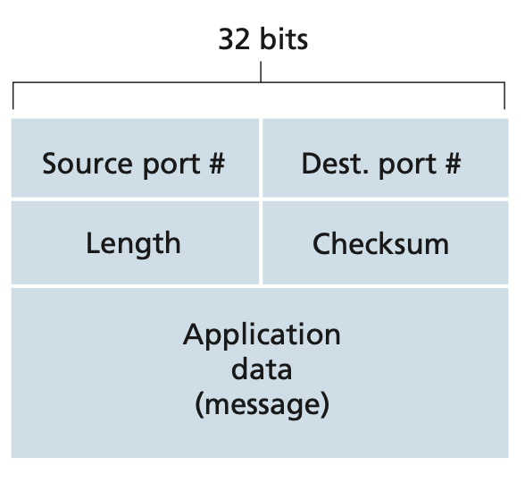
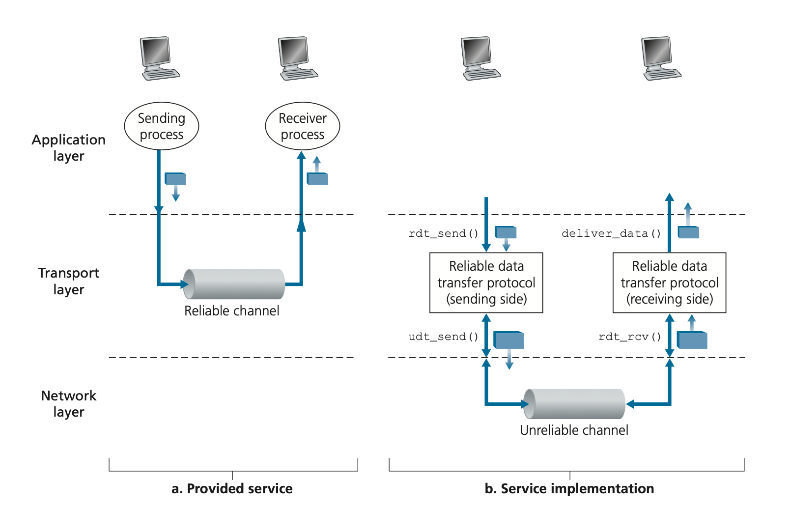
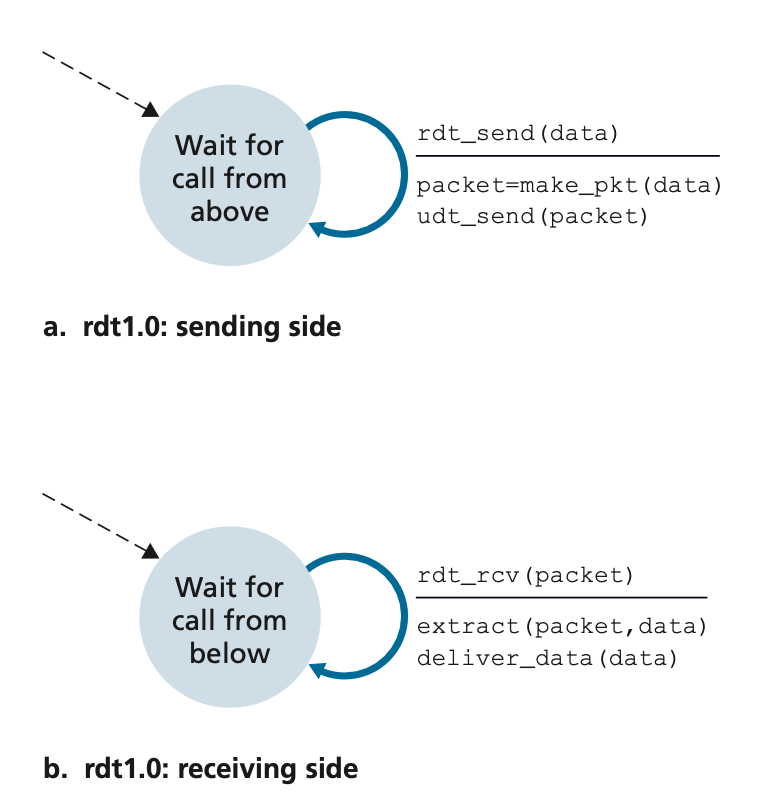
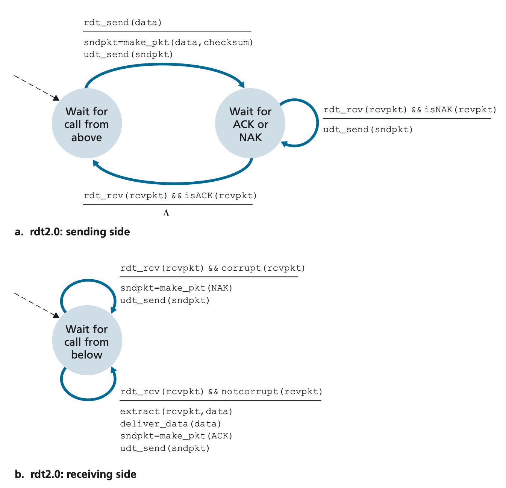
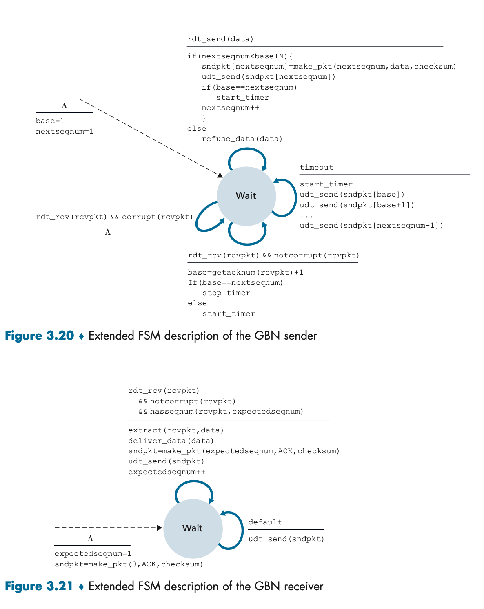
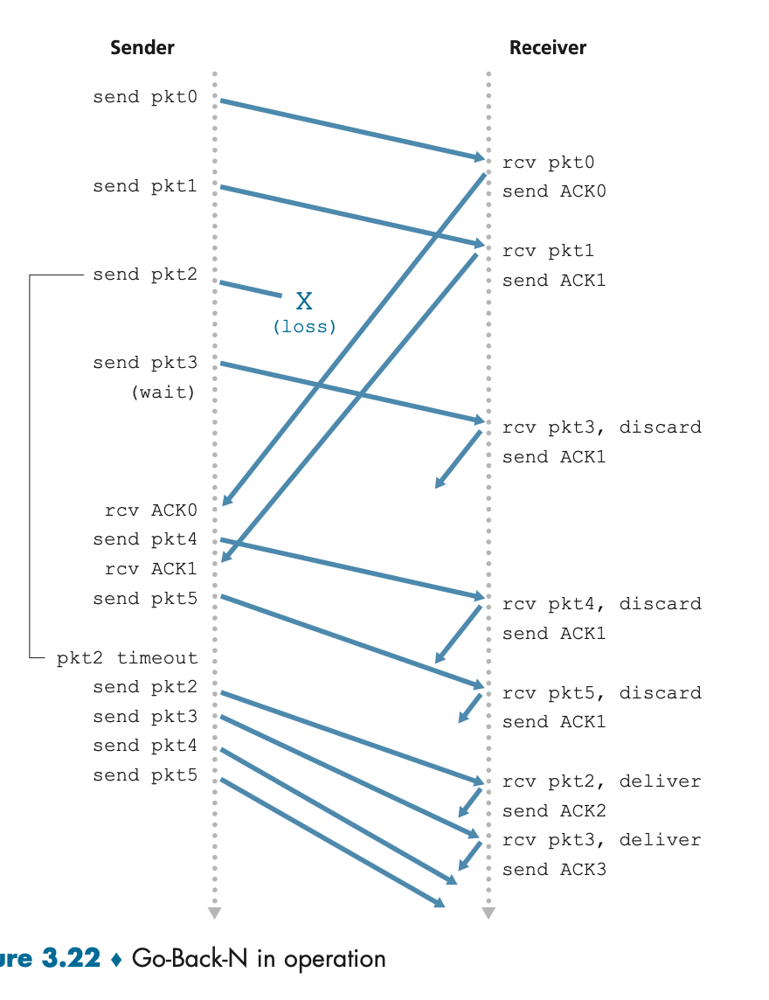
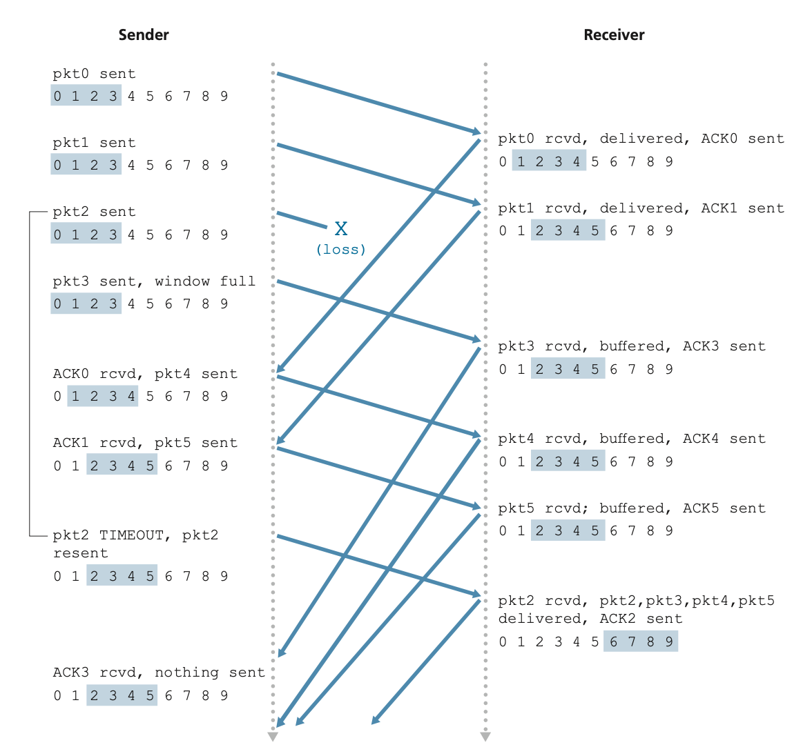
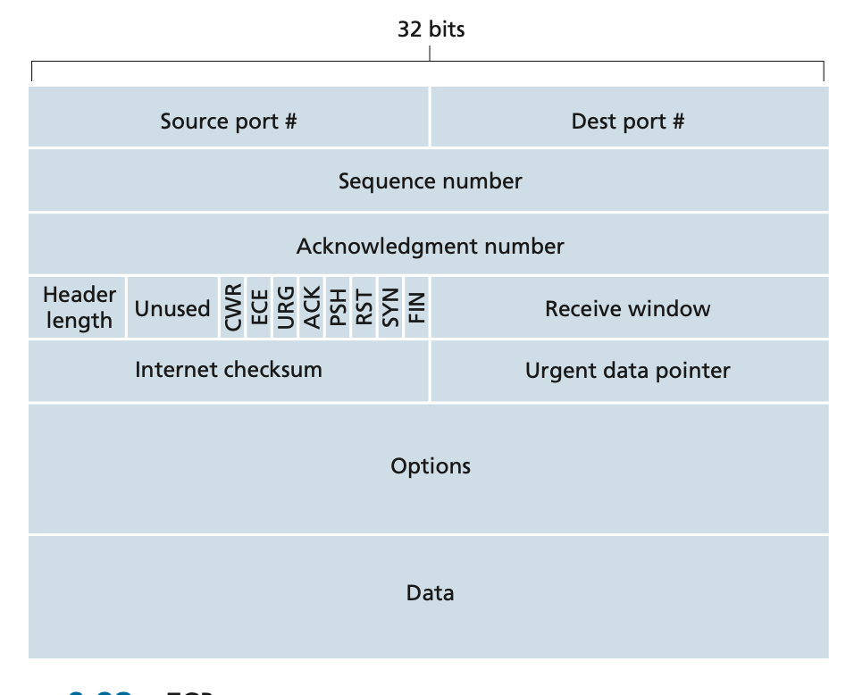
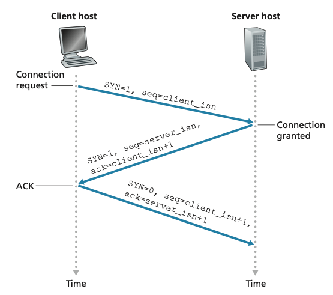
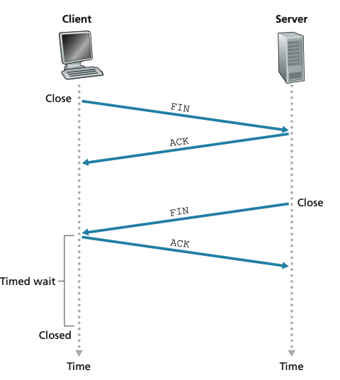

# 3. Transport layer

# 3.1 Introduction and Transport-Layer Services

Application processes use the logical communication provided by the transport layer to send messages to each other, free from the worry of the details of the physical infrastructure used to carry these messages.

Transport-layer protocols are implemented in the end systems but not in network routers.

It creates transport-layer `segments` from application messages, by breaking the application messages into smaller chunks and adding a transport-layer header to each chunk.

Network routers do not examine the fields of the transport-layer `segment` encapsulated with the datagram. Its only on the receiving side, where the segment is extracted.

## 3.1.1 Relationship Between Transport and Network Layers

The transport-layer protocol provides logical communication between `processes` running on different hosts, a network-layer protocol provides logical communication between `hosts`.

E.g. sending letters

application messages = letters in envelopes
processes = people writing letters
hosts (also called end systems) = where people live
transport-layer protocol = someone who drops the letter to the postal service
network-layer protocol = postal service (including mail carriers)

## 3.1.2 Overview of the Transport Layer in the Internet

The Internet’s network-layer protocol has a name, IP, for `Internet Protocol`. IP provides logical communication between hosts. The IP service model is a `best-effort delivery service`. This means that IP makes its “best effort” to deliver segments between communicating hosts, but it `makes no guarantees`.

In particular, it does not guarantee segment delivery, it does not guarantee orderly delivery of segments, and it does not guarantee the integrity of the data in the segments. For these reasons, IP is said to be an unreliable service.

UDP and TCP extends IP to provide integrity checking by including error detection fields in their segments' headers.

# 3.2 Multiplexing and Demultiplexing

Transport layer does not directly communicate to application layer, but with a socket does instead.

Each socket has a unique identifier. The format of the identifier depends on whether the socket is a UDP or a TCP socket.

`Demultiplexing`: the transport layer's job of delivery the data to the receiving socket. The transport layer examines the fields in the segment ( destination port number) to determine the receiving socket.

`Multiplexing`: The job of gathering data chunks at the source host from different sockets, encapsulating each data chunk with header information (that will later be used in demultiplexing) to create segments, and passing the segments to the network layer

These two outlines are for the context of the transport layer. Multiplexing and Demultiplexing is applicable to the other layers.

## Connectionless Multiplexing and Demultiplexing

Suppose a process in Host A, with UDP port 19157, wants to send a chunk of application data to a process with UDP port 46428 in Host B.

1. Transport layer in host A makes segment containing application data and source (19157) and destination (46428) port number in header (multiplexing).
2. Transport layer passes segment to network layer.
3. Transport layer in host B delivers the segment to its socket identified by port 46428 (demultiplexing).

A UDP socket is fully `identified` by a two-tuple consisting of a destination IP address and a destination port number.

As a consequence, if two UDP segments have different source IP addresses and/or source port numbers, but have the same `destination` IP address and `destination` port number, then the two segments will be directed to the `same destination process` via the `same destination socket`.

## Connection-Oriented Multiplexing and Demultiplexing

A TCP socket is `identified` by a four-tuple: (source IP address, source port number, destination IP address, destination port number)

This way if take Host A and B, and Server C. Host A makes two connections on port 10000 and 12000 to Server C. Host B makes a single connection on port 10000 to host C.

Server C will still be able to correctly demultiplex the two connections having the same source port number, since the two connections have different source IP addresses. And thus the server will have three sockets open.

# 3.3 Connectionless Transport: UDP

UDP does just about as little as a transport protocol can do. Aside from the multiplexing/demultiplexing function and some light error checking, it adds nothing to IP.

Its is `connectionless` in the sense that no handshaking between sending and receiving transport-layer entities before sending a segment.

It is possible for an application to have reliable data transfer when using UDP, but needs to be done in the application layer. e.g. `QUIC` protocol implements reliability in an application-layer protocol on top of UDP.

## Applications better suited for UDP

-` Finer application-level control over what data is sent, and when`. TCP has a `congestion-control` mechanism that throttles the transport-layer TCP sender when one or more links between the source and destination hosts become excessively congested. TCP will also continue to resend a segment until the receipt of the segment has been `acknowledged` by the destination, regardless of how long reliable delivery takes. UDP better if do not want to overly delay segment transmission, and can tolerate some data loss.

- `No connection establishment`. UDP is faster since no three-way handshake before it starts to transfer data.

- `No connection state`. TCP maintains connection state in the end systems. This connection state includes receive and send buffers, congestion-control parameters, and sequence and acknowledgment number parameters. Can typically support many more active clients when the application runs over UDP rather than TCP
- `Small packet header overhead`. The TCP segment has 20 bytes of header overhead in every segment, whereas UDP has only 8 bytes of overhead.

## 3.3.1 UDP Segment Structure



Length is the number of bytes in the headers plus the message body.

## 3.3.2 UDP Checksum

Determine whether bits within the UDP segment have been altered.

UDP at the sender side performs the 1s complement of the sum of all the 16-bit words in the segment, with any overflow encountered during the sum being wrapped around.

The receiver checks if the sum of the words and the checksum equals to 1111111111111111.

Many link layer protocols provide error checking, but some don't. Even if transferred correctly, errors could still occur in the routers memory.

Better to be safe and check on an `end-end basis`.

When corruption happens some implementations of UDP simply discard the damaged segment; others pass the damaged segment to the application with a warning.

## 3.4 Principles of Reliable Data Transfer

Problem occurs at the link, transport and application layer.



### 3.4.1 Building a Reliable Data Transfer Protocol

#### Reliable Data Transfer over a Perfectly Reliable Channel: rdt1.0

Consider the underlying channel is completely reliable.



Dashed line is the initial state (none in this case).

The event causing the transition is shown above the horizontal line labeling the transition, and the actions taken when the event occurs are shown below the horizontal line.

In practice, the rdt_send(data) event would result from a procedure call by upper layer application.

In practice, the rdt_rcv(packet) event would result from a procedure call (for example, to rdt_rcv()) from the lower-layer protocol.

#### Reliable Data Transfer over a Channel with Bit Errors: rdt2.0-2.2

A more realistic model of the underlying channel is one in which bits in a packet may be corrupted.

To handle bit errors you need a way to let the sender know if transmission was successful or not (need retransmission). Reliable data transfer protocols for retransmission are known as `ARQ (Automatic Repeat reQuest)` protocols.

Three protocol capabilities are required for `ARQ` to handle `bit errors`:

1. `Error detection` - allow the receiver to detect and possibly correct packet bit errors (checksum).
2. `Receiver feedback` - receiver needs to provide explicit feedback to the sender with either a positive (ACK) or negative (NAK) acknowledgment reply.
3. `Retransmission`



It is important to note that when the sender is in the wait-for-ACK-or-NAK state, it cannot get more data from the upper layer; that is, the rdt_send() event can not occur; that will happen only after the sender receives an ACK and leaves this state.

This is known as a `stop and wait protocol`.

Problem with rdt2.0 is that it doesn't handle corrupted bits when the receiver sends an ACK or NAK.

rdt2.1 adds checksum to ACK and NAK

rdt2.2 adds packet sequence to each packed, gets rid of NAK. Just waits for ACK for packet sequence 0, before sending packet sequence 1.

#### Reliable Data Transfer over a Lossy Channel with Bit Errors: rdt3.0

Q: how to detect packet loss and what to do when packet loss occurs.

Set a timeout on the senders packet. Hard to estimate the delay, and waiting for a worst-case delay could mean a long wait until error recovery. The sender could also retransmit the packet before receiver has the chance to ACK. Leads to the possibility of `duplicate` data packets in the sender-to-receiver channel.

rdt2.2 handles the issue of duplicate packets, just keep track of a sequence number.

### 3.4.2 Pipelined Reliable Data Transfer Protocols

The prior approaches were stop and wait. Just sending one packet and waiting for an ACK, means that the sender and receivers link is under utilized, and most of the time spent in the RTT.

We can instead send multiple packets without waiting for acknowledgments. This technique is known as `pipelining`.

`Pipelining` has the following consequences for reliable data transfer protocols:

1. need a large range of sequence numbers
2. both sides need to buffer more than one packet at a time

The requirements of these two depends on how the protocol responds to lost, corrupted, and overly delayed packets. Two basic approaches toward pipelined error recovery can be identified:`Go-Back-N` and `selective repeat`.

### 3.4.3 Go-Back-N (GBN)

Sets a `threshold` (N) on how many packets can be sent that have not been acknowledged.

It operates as a sliding window, where the N is the largest window length. Window start moves right while packet has been sent and ACKd.



With N = 4:


### 3.4.4 Selective Repeat (SR)

Problem with GBN is that it needs to re-transmit a lot of packets for just a single packet error.

Avoids unnecessary retransmissions by having the sender retransmit only those packets that it suspects were received in error (that is, were lost or corrupted) at the receiver.

A window size of N will again be used to limit the number of outstanding, unacknowledged packets in the pipeline.

If sequence numbers are reused, the window size must be less than or equal to half the size of the sequence number space for SR protocols.

#### Sender

When a data is received from above, makes sure the sequence number fits inside the window, if it does data is packetized and sen

Each packet will have its own timer, so only one is re-transmitted for each timeout.

When an ACK is received, the corresponding packet is marked as being ACK'd. The window_left is moved to the first `unacknowledged packet`.

If the window moves and there are `untransmitted packets` with sequence numbers that now fall within the window, these packets are transmitted.

#### Receiver

`If the packet falls within the window then`, check to see if its sequence number is the window_left. If not (out of order) its buffered and an ACK is sent. If it is then that packet along with all others in front of it that have be buffered in the widow are delivered to upper layer. window_left and right are moved accordingly.

`If packet before window`, resend an ACK.

`If packet above the window` ignore.



# 3.5 Connection-Oriented Transport: TCP

## 3.5.1 The TCP Connection

A TCP connection provides a `full-duplex` service (can flow both ways at same time).

It is also `point to point`, the transfer of data from one sender to many receivers in a single send operation—is not possible.

Client sends special segment, server responds with another special segment, client then sends another special segment. Three segments are sent between the two hosts which is why its called a `three way handshake`.

`TCP buffer` is where sending and reciving will grab chunks of data from.

### MSS and MTU

The maximum amount of data that can be grabbed and placed in a segment is limited by the `maximum segment size` (MSS).

The MSS is typically set by first determining the length of the largest link-layer frame that can be sent by the local sending host (the so-called `maximum transmission unit`, MTU), and then setting the `MSS` to ensure that a TCP segment (when encapsulated in an IP datagram) plus the TCP/IP header length (typically 40 bytes) will fit into a single link-layer frame.

Both Ethernet and PPP link-layer protocols have an MTU of 1,500 bytes. Thus, a typical value of MSS is 1460 bytes.

Note that the MSS is the maximum amount of application-layer data in the segment, not the maximum size of the TCP segment including headers.

TCP pairs each chunk of client data with a TCP header, thereby forming `TCP segments`. The segments are passed down to the network layer, where they are separately encapsulated within network-layer IP `datagrams`. The IP `datagrams` are then sent into the network.

## 3.5.2 TCP Segment Structure



### Sequence Numbers and Acknowledgment Numbers

The sequence number for a segment is the byte-stream number of the first byte in the segment.

E.g. if file is 3000 bytes and MSS is 1000, then the first segment gets assigned sequence number 0, the second segment gets assigned sequence number 1,000, the third segment gets assigned sequence number 2,000, and so on.

With `acknowledgments` if the receiver has received bytes from 0-500 it sends an ack of 501. This way if it receives 0-500 and 750-100, it sends 501 so the missing bits of 501-749 can be sent.

TCP only `acknowledges` bytes up to the first missing byte in the stream, TCP is said to provide cumulative acknowledgments.

both sides of a TCP connection randomly choose an `initial sequence number`. This is done to minimize the possibility that a segment that is still present in the network

## 3.5.3 Round-Trip Time Estimation and Timeout

The timeout should be larger than the connection’s `round-trip time` (RTT).

But how much larger? How should the RTT be estimated in the first place? Should a timer be associated with each and every unacknowledged segment?

### Estimating the Round-Trip Time

TCP estimates the round-trip time by taking one RTT measurement (called `SampleRTT`) at time for an unacknowledged segment that has not been retransmitted. So a a new value of `SampleRTT` approximately once every RTT.

Because you could get significant fluctuations between sample to sample, TCP maintains an average `EstimatedRTT` of the `SampleRTT` values. After every new `SampleRTT`, `EstimatedRTT` gets updated to:

```
EstimatedRTT = (1 – α) * EstimatedRTT + α * SampleRTT

# α is usually 0.125
```

This is a `weighted average` puts more weight on recent samples than on old samples.

It is also useful to measure the `variability` between samples. [RFC 6298] defines the RTT variation, `DevRTT`, as an estimate of how much `SampleRTT` typically `deviates` from `EstimatedRTT`:

```
DevRTT = (1 – β) * DevRTT + β * ( SampleRTT – EstimatedRTT )

# The recommended value of β is 0.25.
```

### Setting and Managing the Retransmission Timeout Interval

Given values of EstimatedRTT and DevRTT, what value should be used for TCP’s timeout interval? Desirable to set the timeout equal to the `EstimatedRTT` plus some `margin`.

TCP’s method for determining the retransmission timeout interval:

```
TimeoutInterval = EstimatedRTT + 4 * DevRTT
```

## 3.5.4 Reliable Data Transfer

`IP does not` guarantee datagram delivery, does not guarantee `in-order delivery` of datagrams, and does not guarantee the `integrity` of the data in the datagrams. Due to router buffers overflow, bits corrupted and bits out of order.

### Sender Event handling

Take a simple example where sender is not constrained by TCP flow or congestion control, that data from above is less than MSS in size, and that data transfer is in one direction only.

There are three events to handle; Receiving application data, timer timeout, ACK received.

```
NextSeqNum=InitialSeqNumber
SendBase=InitialSeqNumber

loop (forever) {
    switch(event)
        event: data received from application above
            create TCP segment with sequence number NextSeqNum
            if (timer currently not running)
                start timer
            pass segment to IP
            NextSeqNum=NextSeqNum+length(data)
            break;
        event: timer timeout
            retransmit not-yet-acknowledged segment with
                smallest sequence number
            start timer
            break;
        event: ACK received, with ACK field value of y
            if (y > SendBase) {
                SendBase=y
                if (there are currently any not yet acknowledged segments)
                    start timer
            } else {/* a duplicate ACK for already ACKed segment */
                increment number of duplicate ACKs received for y
                if (number of duplicate ACKS received for y==3)
                    /* TCP fast retransmit */
                    resend segment with sequence number y
            }
            break;
}
```

### Doubling the Timeout Interval

Most TCP implementations will keep doubling the timeout interval when it needs to retransmit. But it resets to using `EstimatedRTT` with `DevRTT` when an ACK is received. This is for congestion control.

### Fast Retransmit

If sender sends several segments say (92, 100, 120, 135, 140), but seq=100 never makes it to receiver, the receiver will send 4 acks=100, (3 duplicate ACKs).

When the TCP sender receives 3 duplicate ACKs it can tell the second sequence probably got lost. It will then perform a `fast retransmit`, retransmitting the missing segment before that segment’s timer expires.

Remember receiver uses incremental ACKs so when sender re-sends seq=100, receiver has the others buffered and will end up sending an ACK of 141. So sender doesnt need to retransmits the others.

### Go-Back-N or Selective Repeat?

TCP is closer to GBN. But TCP will re-transmit at most one packet at a time.

## 3.5.5 Flow Control

When TCP receives bytes that are in correct order, it puts in a buffer for application process to read. But if application process is busy, this buffer could overflow if bytes keep getting placed in it. TCP provides a `flow-control service` to match the rate of the sender and the receiving application process.

Note: a TCP sender can also be throttled due to congestion within the IP network; this form of sender control is referred to as `congestion control` (3.6, 3.7).

In `flow control` the sender maintain a variable called the `receive window`, which gives an indication of how much free buffer space is available at the receiver.

Let `LastByteRead` = last byte read by receiving application, `LastByteRcvd` = last byte received in buffer, `RcvBuffer` = buffer size, `rwnd` = bytes left in buffer.

If A is sending to B, B puts the current value of `rwnd` is placed in the `receive window field` of every segment it sends to A.

Host A keeps track of `LastByteSent` and `LastByteAcked`, where `LastByteSent - LastByteAcked` is the amount of unacknowledged data that A has sent into the connection. Host A makes sure throughout the connection’s life that `LastByteSent – LastByteAcked <= rwnd`.

Host B only sends `rwnd` to Host A when it has data to send or if it has an acknowledgment to send. So if Host B sends `rwnd=0` Host A wont do anything. To solve this Host A will continually send 1 byte requests that get acknowledged.

UDP DOES NOT provide this.

## 3.5.6 TCP Connection Management

This section overviews how a TCP connection is establish and torn down.

The SYN flood attack exploit vulnerabilities in TCP connection management.

### Opening a TCP connection

1. Client sends a TCP (SYN) segment with the SYN header bit set to 1, and w/o application data. It also randomly chooses and uses an initial sequence number (`client_isn`) in the same segment. This segment is sent to server.
2. Server extracts SYN segment, and allocates TCP buffers and variables for the connection. Stores client ip and port, client_isn, server_isn, amongst others. It then sends a connection-granted segment (w/o application data) to client. This segment has following headers set; SYN=1, ACK=client_isn+1, and generates own initial sequence number (`server_isn`) as sequence felid. This segment is referred to as a `SYNACK segment`
3. If client receives the SYNACK segment it allocates buffers and variables for connection. Then sends server an `acknowledgment segment` with ACK=server_isn+1, and SYN=0. This third stage of the three-way handshake may carry application data in the payload. The server needs to validate that this packet matches a record for client's ip and port, server_isn = ACK-1, and client_isn=SEQ-1.



### Closing a TCP connection



The wait state lets the TCP client resend the final acknowledgment in case the ACK is lost. The time spent in the wait state is implementation-dependent, but typical values are 30 seconds, 1 minute, and 2 minutes.

After the wait all the resources in the two hosts are now deallocated.

### Init unknown connection

If a host receives a TCP SYN packet with destination port 80, but the host is not accepting connections on port 80. Then the host will send a `reset` segment (`RST` flag set to 1). This lets the client know that the server does not have a socket for the segment and don't resend it.

### nmap and TCP

To explore a specific TCP port (e.g. 6789), namp sends a TCP `SYN` segment with destination port=6789 to the host.

There are three possible outcomes:

1. Source receives a TCP `SYNACK` from host, this means application is running on that port so return `open`.
2. Source receives a TCP `RST` segment from host. This means its not running, but port is not blocked by any firewall between host and source.
3. Source receives nothing, likely meaning that the `SYN` was blocked by a firewall.

### SYN Flood Attack

A `SYN flood attack` is a DOS attack where the client sends large amounts of `SYN` segments, without completing the handshake. All the SYNS causes the server to allocate resources each time, and resources become exhausted. Eventually (often after a minute or more) the server will terminate the half-open connection and reclaim the allocated resources.

An effective defense known as `SYN cookies` [RFC 4987] are now deployed in most major operating systems. SYN cookies work as follows:

- the server creates an initial TCP sequence number from (a cookie) hash(source ip, dest ip, dest port, secret only server knows). Sends the client a SYNACK packet with this special initial sequence number. Server doesn't remember the cookie. It also doesn't need to allocate anything at this point.
- a legitimate client will send an `ACK=server_isn + 1`, the server will run the same function plus one. If it matches the server concludes that the ACK corresponds to an earlier SYN segment and is hence valid. The server reconstructs the original connection state and establishes the connection.
- if the client does not return an ACK segment, then the original SYN has done no harm at the server, since the server hasn’t yet allocated any resources in response to the original bogus SYN.

Without SYN cookies, the server must maintain some state information even before receiving the ACK. This state includes the client's information and the sequence numbers for the TCP connection. It uses this info to validate the ACK. This partial state still consumes memory and processing power, which can be exploited in a SYN flood attack to exhaust the server's resources.

# 3.6 Principles of Congestion Control
